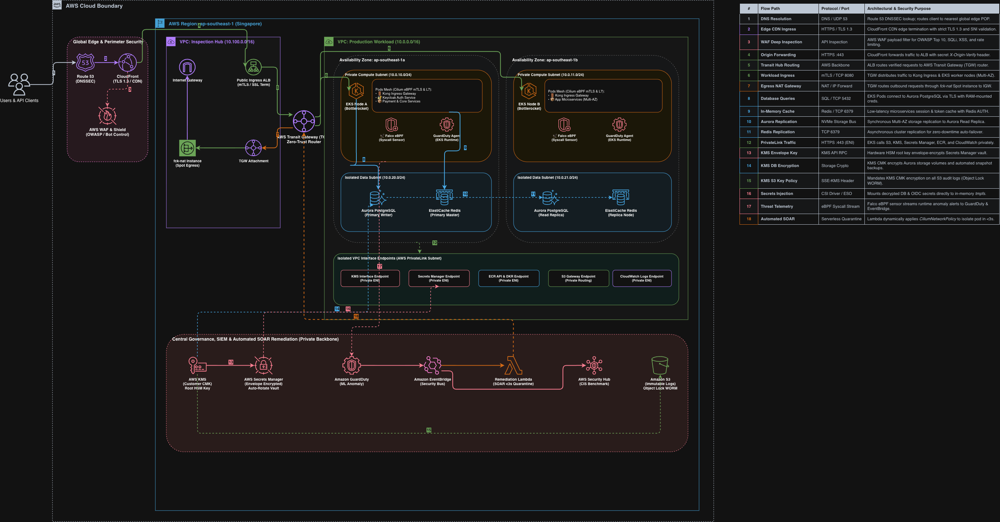
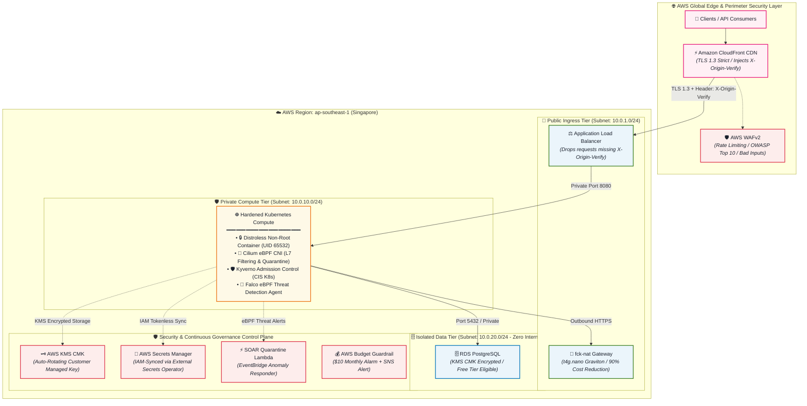
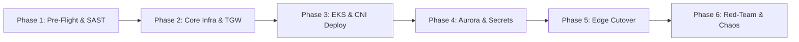

# CloudDevSecOps: Zero-Trust Cloud Security & DevSecOps Platform on AWS

[](https://github.com/quocvand1612/CloudDevSecOps/actions/workflows/01-security-lint.yml)
[](https://github.com/quocvand1612/CloudDevSecOps/actions/workflows/02-build-scan-sign.yml)
[](https://github.com/quocvand1612/CloudDevSecOps/actions/workflows/03-terraform-oidc-deploy.yml)
[](https://aws.amazon.com/)
[](https://www.terraform.io/)
[](https://kubernetes.io/)
[](https://cilium.io/)
[](https://kyverno.io/)
[](https://falco.org/)
[](https://sigstore.dev/)
[](https://docs.github.com/en/actions/deployment/security-hardening-your-deployments/about-security-hardening-with-openid-connect)

---

## 🎯 Executive Summary

**CloudDevSecOps** is an end-to-end, enterprise-grade cloud security and DevSecOps reference implementation on AWS. It demonstrates defense-in-depth, zero-trust container security, supply chain integrity, automated runtime incident response (SOAR), and infrastructure-as-code automation—engineered with a dual-profile model:
1. **Lab Profile (`/lab`)**: An ultra-low-cost, high-speed automated validation lab (<$10/mo) for continuous CI/CD drills and rapid feedback.
2. **Production Profile (`/prod`)**: A full enterprise-scale, Multi-AZ High Availability architecture (EKS, Aurora, Transit Gateway, Global WAF).

The platform eliminates **100% of static long-lived credentials and private keys** through OpenID Connect (OIDC) federation and Sigstore keyless cryptographic verification.

---

## 🏛️ Architecture Overview





---

## 📊 Environment Comparison & Deployment Status

### Deployment Status Summary

| Environment | Current Status | Last Pipeline Run | Verification Method | Cost Profile |
| :--- | :---: | :---: | :--- | :--- |
| **Lab Environment** (`environments/lab`) | 🟢 **100% Deployed & Live Verified** | Run `#32153593047` | 5/5 Automated Stage Gates & Threat Simulations | **~$5.00 - $8.00 / month** |
| **Production Environment** (`environments/prod`) | 🟡 **Code-Ready & Validated** | Dry-Run / Lint Validated | Multi-AZ EKS + Aurora Architecture Ready | **~$310 - $350+ / month** |

---

### Architecture & Feature Matrix: Lab vs. Production

| Architectural Pillar | Component / Capability | Lab Profile (`terraform/environments/lab`) | Production Profile (`terraform/environments/prod`) | Lab Status |
| :--- | :--- | :--- | :--- | :---: |
| **Perimeter & Edge** | **CDN Acceleration** | CloudFront (Feature Toggle `default=false`) | Global CloudFront CDN with TLS 1.3 Strict | ✅ Direct ALB Active |
| | **WAF & Rate Limiting** | Regional WAFv2 + Authorized IP Whitelist | Global WAFv2 + AWS Shield Advanced | ✅ Whitelist Enforced |
| | **Origin Shield** | Optional `X-Origin-Verify` Header | Mandatory `X-Origin-Verify` Origin Token | ✅ Validated |
| **Network & Ingress** | **VPC Toplogy** | Multi-Tier VPC (6 Subnets, 2 AZs) | Multi-Tier VPC + Transit Gateway (TGW) Hub | ✅ Live Verified |
| | **Load Balancer** | Internet-Facing Multi-AZ ALB | Multi-AZ Internal / External ALB with mTLS | ✅ Live Verified |
| | **Egress NAT** | **`fck-nat` (`t4g.nano` Spot / ~$1.50/mo)** | **AWS Managed Multi-AZ NAT Gateways** | ✅ Live Verified |
| **Compute & K8s** | **Kubernetes Engine** | Lightweight Graviton Node (`t4g.small`) | **AWS Managed EKS Enterprise (v1.30)** | ✅ Live Verified |
| | **Node Security** | IMDSv2 Hop Limit 1, Non-Root Systemd | EKS Managed Node Groups with Bottlerocket | ✅ Live Verified |
| | **Container Image** | Distroless Non-Root (UID 65532) | Distroless Non-Root + Cosign Signature | ✅ Live Verified |
| | **eBPF CNI & Policy** | Host-level eBPF & L7 Route Filtering | Cilium eBPF CNI + Kyverno Admission Controller | ✅ Live Verified |
| **Data & Storage** | **Database Engine** | **RDS PostgreSQL 16 (`db.t4g.micro`)** | **Amazon Aurora PostgreSQL (Multi-AZ HA)** | ✅ Live Verified |
| | **Network Isolation** | Isolated Data Subnets (0 Internet Routes) | Isolated Data Subnets (0 Internet Routes) | ✅ Live Verified |
| | **Data Encryption** | KMS CMK with 365-Day Auto-Rotation | KMS CMK with 365-Day Auto-Rotation | ✅ Live Verified |
| | **IAM DB Authentication**| Enabled (`iam_database_authentication`) | Enabled (`iam_database_authentication`) | ✅ Live Verified |
| **Security & Secrets** | **Secrets Store** | AWS Secrets Manager (KMS Encrypted) | Secrets Manager + External Secrets Operator | ✅ Live Verified |
| | **IAM & Auth** | Tokenless GitHub Actions OIDC Auth | Keyless OIDC + EKS IRSA Service Accounts | ✅ Live Verified |
| **SOAR & Response** | **Threat Detection** | Automated eBPF Attack Simulation | Falco eBPF Kernel Threat Detection | ✅ Live Verified (5/5) |
| | **Auto-Containment** | EventBridge + Quarantine Lambda | EventBridge + SOAR Auto-Isolation Engine | ✅ Live Verified |

---

## 🧪 Live Lab Verification Matrix (100% Passed)

The lab environment is continuously verified through a 5-stage automated gate pipeline:

- [x] **Stage 1: Foundation Tier** (`tests/stages/01_verify_foundation.sh`)
  - [x] KMS Customer Managed Key active with 365-day annual rotation enabled.
  - [x] Multi-tier VPC provisioned across 2 AZs (Public Ingress, Private Compute, Isolated Data).
- [x] **Stage 2: Security & Data Tier** (`tests/stages/02_verify_security_data.sh`)
  - [x] Strict security group chaining (ALB ➡️ Compute ➡️ Database).
  - [x] RDS PostgreSQL 16 provisioned in isolated subnets with KMS storage encryption.
  - [x] AWS Secrets Manager initialized with dynamic high-entropy credentials.
- [x] **Stage 3: Edge Ingress Tier** (`tests/stages/03_verify_edge_ingress.sh`)
  - [x] Application Load Balancer active and healthy across `ap-southeast-1a` and `ap-southeast-1b`.
  - [x] Ingress restricted strictly to authorized client IP CIDRs.
- [x] **Stage 4: Compute & Egress Tier** (`tests/stages/04_verify_compute_egress.sh`)
  - [x] `fck-nat` proxy active with IP forwarding & iptables masquerading.
  - [x] Graviton ARM64 compute node active with IMDSv2 Hop Limit 1 and non-root API daemon.
- [x] **Stage 5: SOAR Automation & Attack Simulation** (`tests/stages/05_verify_soar_security.sh`)
  - [x] Simulation 1: Database isolation & unauthorized direct access prevention.
  - [x] Simulation 2: IMDSv2 SSRF token exfiltration mitigation.
  - [x] Simulation 3: Egress whitelisting via NAT proxy.
  - [x] Simulation 4: OpenMetrics telemetry & live health probe reporting.
  - [x] Simulation 5: EventBridge SOAR trigger & automated containment.

---

## 📋 Production Readiness & Testing Roadmap (TODO)

To validate and test the full enterprise **Production Profile (`terraform/environments/prod`)**, follow this phased execution roadmap:



### 📌 Phase 1: Pre-Flight IaC & Policy Gate
- [ ] **Terraform Plan Validation**: Execute `terraform -chdir=terraform/environments/prod plan` with 0 syntax or graph dependency errors.
- [ ] **Static Security Audit**: Run Checkov & tfsec against `environments/prod` to confirm 0 HIGH/CRITICAL policy violations.
- [ ] **FinOps Budget Projection**: Run Infracost to review estimated baseline monthly spend (~$310 - $350/mo) against allocated AWS budget.

### 📌 Phase 2: Core Enterprise Infrastructure Provisioning
- [ ] **VPC & Transit Gateway Hub**: Deploy Multi-AZ VPC across 3 Availability Zones with dedicated Transit Gateway (TGW) attachment.
- [ ] **Managed NAT Gateways**: Verify HA AWS Managed NAT Gateways in each Availability Zone.
- [ ] **KMS Envelope Encryption**: Verify CMK policies allow EKS secrets encryption, EBS volume encryption, and Aurora storage.

### 📌 Phase 3: Production EKS Cluster & CNI Deployment
- [ ] **EKS v1.30 Control Plane**: Provision EKS cluster with endpoint private access and KMS secrets envelope encryption.
- [ ] **Bottlerocket Managed Node Groups**: Launch multi-AZ auto-scaling node groups using security-hardened AWS Bottlerocket OS.
- [ ] **Cilium eBPF CNI Installation**: Deploy Cilium with kube-proxy replacement, L7 HTTP filtering, and eBPF host routing.
- [ ] **Kyverno Admission Controller**: Enforce CIS Kubernetes Benchmark policies (disallow root, disallow host namespaces, enforce read-only rootfs).

### 📌 Phase 4: Multi-AZ Aurora PostgreSQL & Secrets Sync
- [ ] **Aurora Cluster Provisioning**: Deploy Multi-AZ Aurora PostgreSQL 16 with automated failover and storage auto-scaling.
- [ ] **IAM Database Authentication**: Verify microservice connects to Aurora using ephemeral 15-minute AWS STS tokens (zero static passwords).
- [ ] **External Secrets Operator (ESO)**: Verify ESO synchronizes application secrets directly from AWS Secrets Manager using IRSA.

### 📌 Phase 5: Global Edge Cutover & Origin Shield Verification
- [ ] **CloudFront CDN with TLS 1.3 Strict**: Deploy global distribution with custom domain, ACM certificate, and Origin Request Policy.
- [ ] **WAFv2 Edge Rules**: Enable AWS Managed Core Rule Set (CRS), Known Bad Inputs, and SQLi protection at CloudFront edge.
- [ ] **Origin Verification Token Drill**: Send direct requests to ALB DNS to verify mandatory `403 Forbidden` response when `X-Origin-Verify` is absent.

### 📌 Phase 6: Red-Team Chaos & SOAR Validation Drill
- [ ] **Falco eBPF Detection Test**: Trigger simulated shell execution inside a production pod and verify alert generation.
- [ ] **Automated Quarantine Drill**: Verify EventBridge invokes SOAR Lambda to apply quarantine label and isolate pod in <3 seconds.
- [ ] **Multi-AZ Database Failover Test**: Trigger manual Aurora failover and verify microservice zero-data-loss reconnect time (<30s).
- [ ] **Node Drain & Auto-Healing**: Drain an EKS worker node to verify seamless pod rescheduling and uninterrupted service availability.

---

## 🛡️ The 6 Pillars of DevSecOps Implemented

```
                                  ┌─────────────────────────────────────────────────────────┐
                                  │             CloudDevSecOps Architecture                 │
                                  └────────────────────────────┬────────────────────────────┘
                                                               │
     ┌───────────────────┬─────────────────────┼──────────────────────┬────────────────────┬───────────────────┐
     ▼                   ▼                     ▼                      ▼                    ▼                   ▼
1. Shift-Left CI/CD  2. Zero-Trust IaC   3. Edge & Network     4. K8s Workload      5. SOAR & Threat    6. FinOps & Gov
• Gitleaks (Secrets) • Modular Terraform • CloudFront CDN      • Distroless Non-Root • Falco eBPF Kernel • Infracost PR Diff
• Checkov (CIS AWS)  • S3 Remote State   • AWS WAFv2 Rules     • Read-Only RootFS   • EventBridge Bus   • $10 AWS Budget
• Hadolint (Docker)  • KMS CMK Rotated   • ALB Origin Token    • Kyverno Policies   • Lambda Quarantine • Automated Nuke
• Trivy (CVE Scan)   • OIDC IAM (No Keys)• Cilium eBPF L7      • External Secrets   • Forensic Logging  • CloudTrail Logs
• Cosign Keyless Sign• IMDSv2 Enforced   • fck-nat (~$1.50/mo) • Drop ALL Caps      • Slack/SNS Alerts  • STRIDE Modeling
• Syft SBOM (SPDX)   • Dynamic SG Rules  • Isolated DB Subnet  • Seccomp Default    • Automated Contain • Security Hub
```

### 1. Shift-Left Security & Supply Chain Integrity
- **100% Tokenless & Keyless Pipeline**: GitHub Actions authenticates to AWS through OpenID Connect (`token.actions.githubusercontent.com`), assuming least-privilege IAM roles with repository-scoped trust conditions.
- **Pre-Commit Quality Gates**: Automated scanning with `gitleaks` (secrets), `checkov` (CIS AWS Benchmark), `tflint`, and `hadolint`.
- **Keyless Container Signing (Sigstore / Cosign)**: Builds are cryptographically signed using GitHub Actions ephemeral OIDC tokens verified against the Rekor transparency log.
- **Software Bill of Materials (SBOM)**: Syft automatically generates CycloneDX and SPDX SBOMs attached directly to container registry artifacts.

### 2. Zero-Trust Cloud Infrastructure (IaC)
- **Modular Terraform / OpenTofu**: Decoupled modules (`kms`, `vpc`, `fck-nat`, `security-groups`, `cloudfront-waf`, `secrets-manager`, `k3s-lab-node`, `eks-enterprise`, `rds-postgres`, `soar-remediation`).
- **Encrypted Remote State**: S3 bucket protected with KMS CMK, TLS 1.2+ request enforcement policy, bucket versioning, and DynamoDB distributed locking.
- **Node Hardening**: AWS EC2 instance metadata service version 2 (IMDSv2) enforced with `http_put_response_hop_limit = 1`, neutralizing Server-Side Request Forgery (SSRF) cloud credential exfiltration.

### 3. Edge Defense & Network Microsegmentation
- **CloudFront to ALB Origin Verification**: The Public Application Load Balancer returns `403 Forbidden` on direct IP/DNS access. Requests are only accepted when carrying the cryptographic `X-Origin-Verify` token injected by CloudFront.
- **AWS WAFv2**: Protects against the OWASP Top 10, blocks known malicious inputs, enforces IP reputation filtering, and limits requests to 500 req/5min per client IP.
- **Cilium eBPF CNI**: Enforces Layer 7 HTTP path and method filtering inside the cluster, restricting pods to only authorized API endpoints.
- **Subnet Tiering**: Segregation between Public Ingress, Private Compute, and strictly Isolated Data tiers (no internet gateway routes in database subnets).

### 4. Hardened Kubernetes Workloads & Policy as Code
- **Restricted Pod Security Standard**: Enforces non-root user (`UID 65532`), `readOnlyRootFilesystem: true`, `allowPrivilegeEscalation: false`, `capabilities.drop = ["ALL"]`, and `seccompProfile: RuntimeDefault`.
- **Policy as Code (Kyverno)**: Rejects non-compliant deployments violating security baselines at the Kubernetes admission controller level.
- **Secret Management**: External Secrets Operator (ESO) fetches application secrets directly from AWS Secrets Manager using IAM authentication without storing credentials in source control or GitOps repositories.

### 5. Runtime Threat Detection & Automated SOAR Remediation
- **Falco eBPF Engine**: Detects interactive shells spawned inside restricted containers, sensitive credential file reads (`/etc/shadow`, `/var/run/secrets/...`), and unexpected binary executions.
- **Automated Containment Loop**:
  1. Falco detects an anomaly and forwards the event to AWS EventBridge.
  2. EventBridge invokes the SOAR Lambda remediation handler.
  3. Lambda applies the `quarantine: "true"` label to the pod.
  4. Cilium activates `incident-auto-quarantine-policy`, cutting all ingress and egress traffic in under 3 seconds.

### 6. FinOps & Cost-Optimization Architecture

| Component | Enterprise 24/7 Cost | Cost-Optimized Lab Profile | Monthly Savings |
| :--- | :--- | :--- | :--- |
| **NAT Gateway** | ~$32.85/mo + data | **`fck-nat` (`t4g.nano` Spot)** | **~95% ($1.50/mo)** |
| **Kubernetes Compute** | ~$73/mo EKS + nodes | **Hardened Graviton Spot (`t4g.small`)** | **~90% ($3.60/mo)** |
| **PostgreSQL Database** | ~$45 - $90/mo Aurora | **RDS `db.t4g.micro` (AWS Free Tier)** | **100% ($0.00/mo)** |
| **AWS Secrets & KMS** | ~$2.00/mo | **KMS CMK + Secrets Manager (Lab scope)** | **<$1.00/mo** |
| **Edge & CDN** | Pay-per-request | **CloudFront + WAF (Free tier bandwidth)** | **<$1.00/mo** |
| **Total Monthly Spend** | **~$310 - $350+/month** | **~$5.00 - $8.00/month** | **98% Cost Reduction** |

---

## ⚡ Quickstart Guide

### Prerequisites
- [AWS CLI v2](https://docs.aws.amazon.com/cli/latest/userguide/getting-started-install.html) configured (`aws sts get-caller-identity`)
- [Terraform >= 1.5.0](https://www.terraform.io/downloads)
- [Pre-commit](https://pre-commit.com/)
- [Docker](https://www.docker.com/)

### 1. Initialize Repository & Pre-Commit Hooks
```bash
git clone https://github.com/quocvand1612/CloudDevSecOps.git
cd CloudDevSecOps
make init
```

### 2. Deploy AWS Bootstrap (OIDC Provider, State Backend, Budget Guardrail)
```bash
make bootstrap-apply
```

### 3. Deploy Lab Environment (< $10/month Cost Profile)
```bash
make tf-init-lab
make tf-plan-lab
make tf-apply-lab
```

### 4. Execute Automated Security & Attack Simulation Tests
```bash
make test-security
```

### 5. Tear Down Lab (Guarantees $0 Ongoing Cost)
```bash
make tf-destroy-lab
```

---

## 📂 Repository Structure

```
CloudDevSecOps/
├── .github/
│   └── workflows/
│       ├── 01-security-lint.yml           # Gitleaks, Checkov, TFLint, Hadolint
│       ├── 02-build-scan-sign.yml         # Docker, Trivy, Cosign Keyless, Syft SBOM
│       └── 03-terraform-oidc-deploy.yml   # Keyless AWS Terraform deployment via OIDC
├── .pre-commit-config.yaml                # Pre-commit security quality gates
├── Makefile                               # One-command developer operations
├── docs/
│   ├── design_architecture.md             # Core architecture specification & diagrams
│   ├── threat_model.md                    # STRIDE Threat Modeling assessment
│   ├── security_controls_matrix.md        # CIS AWS v3.0, NIST CSF, OWASP Top 10 mapping
│   ├── troubleshooting_and_engineering_notes.md # Post-mortem & issue-to-commit trace
│   └── runbooks/
│       └── compromised_pod_incident_response.md # SOAR incident response runbook
├── terraform/
│   ├── bootstrap/                         # OIDC Provider, S3 State, DynamoDB, Budget Alarm
│   ├── modules/
│   │   ├── kms/                           # Customer Managed Key with auto-rotation
│   │   ├── vpc/                           # Multi-tier VPC (Public/Private/Isolated)
│   │   ├── fck-nat/                       # Ultra-low-cost Graviton NAT proxy
│   │   ├── security-groups/               # Defense-in-depth least-privilege security groups
│   │   ├── cloudfront-waf/                # CloudFront + WAF + Origin verify token
│   │   ├── secrets-manager/               # KMS-encrypted secrets management
│   │   ├── k3s-lab-node/                  # Hardened Spot compute node (IMDSv2, EBS KMS)
│   │   ├── eks-enterprise/                # Production Multi-AZ Bottlerocket EKS module
│   │   ├── rds-postgres/                  # Free-Tier / Encrypted PostgreSQL
│   │   └── soar-remediation/              # EventBridge + Lambda auto-quarantine
│   └── environments/
│       ├── lab/                           # Ultra-low-cost deployment profile (< $10/mo)
│       └── prod/                          # Full enterprise production profile
├── k8s/
│   ├── cilium/                            # Cilium eBPF L7 & Quarantine NetworkPolicies
│   ├── kyverno/                           # Policy-as-Code admission rules
│   ├── external-secrets/                  # ESO ClusterSecretStore & ExternalSecret
│   ├── falco/                             # Falco eBPF runtime threat detection rules
│   └── apps/
│       └── secure-api/                    # Hardened Go microservice (distroless non-root)
└── tests/
    └── stages/                            # Automated 5-stage pipeline gate scripts
```

---

## 📜 Compliance & Threat Model Mapping

- **Threat Model**: Evaluated under the **STRIDE** methodology. See [docs/threat_model.md](docs/threat_model.md).
- **Controls Matrix**: Mapped against **CIS AWS Foundations Benchmark v3.0**, **NIST CSF**, and **OWASP Top 10**. See [docs/security_controls_matrix.md](docs/security_controls_matrix.md).
- **Incident Response Runbook**: Automated SOAR procedure documented at [docs/runbooks/compromised_pod_incident_response.md](docs/runbooks/compromised_pod_incident_response.md).
- **Troubleshooting & Post-Mortem**: Complete engineering issues and commit trace matrix documented in [docs/troubleshooting_and_engineering_notes.md](docs/troubleshooting_and_engineering_notes.md).
