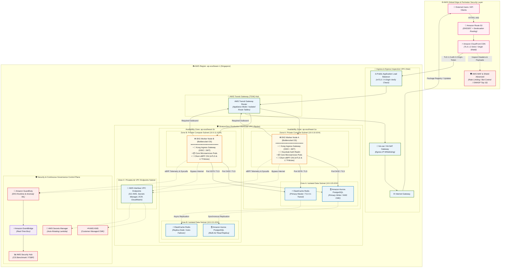

```mermaid
flowchart TB
    %% Styling Definitions based on AWS Official Color Guidelines
    classDef edgeStyle fill:#FFF0F5,stroke:#E7157B,stroke-width:2px,color:#1A202C;
    classDef netStyle fill:#EBF5FB,stroke:#3B7E24,stroke-width:2px,color:#1A202C;
    classDef secStyle fill:#FDEDEC,stroke:#DD344C,stroke-width:2px,color:#1A202C;
    classDef computeStyle fill:#FEF9E7,stroke:#EC7211,stroke-width:2px,color:#1A202C;
    classDef dbStyle fill:#EBF5FB,stroke:#0073BB,stroke-width:2px,color:#1A202C;
    classDef mgmtStyle fill:#F4ECF7,stroke:#8C4FFF,stroke-width:2px,color:#1A202C;

        subgraph GlobalEdge ["🌐 AWS Global Edge & Perimeter Security Layer"]
            User["👥 External Users / API Clients"]
            R53["📍 Amazon Route 53<br><i>(DNSSEC + Geolocation Routing)</i>"]
            CF["⚡ Amazon CloudFront CDN<br><i>(TLS 1.3 Strict / Origin Shield)</i>"]
            WAF["🛡️ AWS WAF & Shield Advanced<br><i>(Rate Limiting / Bot Control / OWASP Top 10)</i>"]
        end
        class R53,CF,User edgeStyle;
        class WAF secStyle;

        subgraph AWS_Region ["☁️ AWS Region: ap-southeast-1 (Singapore)"]

            subgraph VPC_Inspection ["🏢 Ingress & Egress Inspection VPC (Hub)"]
                IGW["🌐 Internet Gateway"]
                ALB_Ext["⚖️ Public Application Load Balancer<br><i>(mTLS / X-Origin-Verify Check)</i>"]
                FCK_NAT["🔄 fck-nat / HA NAT Gateway<br><i>(Egress IP Whitelisting)</i>"]
            end
            class IGW,ALB_Ext,FCK_NAT netStyle;

            subgraph TGW_Layer ["🔀 AWS Transit Gateway (TGW) Hub"]
                TGW["AWS Transit Gateway Router<br><i>(Appliance Mode / Isolated Route Tables)</i>"]
            end
            class TGW netStyle;

            subgraph VPC_Prod ["🛡️ StratumZero Production Workload VPC (Spoke)"]

                subgraph AZ_A ["Availability Zone: ap-southeast-1a"]
                    subgraph Private_Compute_A ["Zone A: Private Compute Subnet (10.0.10.0/24)"]
                        Node_A["☸️ EKS Worker Node A (Bottlerocket OS)<br>━━━━━━━━━━━━━━━━━━━━━━━<br>• 🚪 Kong Ingress Gateway (OIDC / JWT)<br>• 🔐 Keycloak Auth Realm<br>• 📦 Core Microservices Pods<br>• 🐝 Cilium eBPF CNI (mTLS & L7 Policies)"]
                    end
                    subgraph Isolated_Data_A ["Zone A: Isolated Data Subnet (10.0.20.0/24)"]
                        Aurora_Primary["🗄️ Amazon Aurora PostgreSQL<br><i>(Primary Writer / KMS CMK)</i>"]
                        Redis_Primary["⚡ ElastiCache Redis<br><i>(Primary Master / TLS In-Transit)</i>"]
                    end
                end

                subgraph AZ_B ["Availability Zone: ap-southeast-1b"]
                    subgraph Private_Compute_B ["Zone B: Private Compute Subnet (10.0.11.0/24)"]
                        Node_B["☸️ EKS Worker Node B (Bottlerocket OS)<br>━━━━━━━━━━━━━━━━━━━━━━━<br>• 🚪 Kong Ingress Gateway (OIDC / JWT)<br>• 📦 Core Microservices Pods<br>• 🐝 Cilium eBPF CNI (mTLS & L7 Policies)"]
                    end
                    subgraph Isolated_Data_B ["Zone B: Isolated Data Subnet (10.0.21.0/24)"]
                        Aurora_Replica["🗄️ Amazon Aurora PostgreSQL<br><i>(Multi-AZ Read Replica)</i>"]
                        Redis_Replica["⚡ ElastiCache Redis<br><i>(Replica Node / Auto-Failover)</i>"]
                    end
                end

                subgraph Endpoint_Subnet ["Zone C: PrivateLink VPC Endpoints Subnet"]
                    VPCE["🔗 AWS Interface VPC Endpoints<br><i>(S3, KMS, Secrets Manager, ECR, CloudWatch)</i>"]
                end
            end
            class Node_A,Node_B computeStyle;
            class Aurora_Primary,Aurora_Replica,Redis_Primary,Redis_Replica dbStyle;
            class VPCE netStyle;

            subgraph SecurityPlane ["🛡️ Security & Continuous Governance Control Plane"]
                KMS["🗝️ AWS KMS<br><i>(Customer Managed CMK)</i>"]
                Secrets["🔑 AWS Secrets Manager<br><i>(Auto-Rotating Lambda)</i>"]
                GuardDuty["🔎 Amazon GuardDuty<br><i>(EKS Runtime & Anomaly ML)</i>"]
                SecHub["📊 AWS Security Hub<br><i>(CIS Benchmark / FSBP)</i>"]
                EventBridge["⚡ Amazon EventBridge<br><i>(Real-Time Bus)</i>"]
            end
            class KMS,Secrets,GuardDuty,SecHub secStyle;
            class EventBridge mgmtStyle;
        end

        %% Network Flow Connections
        User -->|HTTPS :443| R53
        R53 --> CF
        CF -.->|Inspect Headers & Payloads| WAF
        CF -->|TLS 1.3 with X-Origin-Token| ALB_Ext
        ALB_Ext --> TGW
        TGW --> Node_A & Node_B

        %% Pod to Data & Auth Connections
        Node_A & Node_B -->|Port 5432 / TLS| Aurora_Primary
        Aurora_Primary -.->|Synchronous Replication| Aurora_Replica
        Node_A & Node_B -->|Port 6379 / TLS| Redis_Primary
        Redis_Primary -.->|Async Replication| Redis_Replica

        %% Internal PrivateLink Services
        Node_A & Node_B -.->|Bypass Internet| VPCE
        VPCE -.-> KMS & Secrets

        %% Egress Flow
        Node_A & Node_B -->|Required Outbound| TGW
        TGW --> FCK_NAT
        FCK_NAT --> IGW
        IGW -->|Package Registry / Updates| User

        %% Observability Stream
        Node_A & Node_B -.->|eBPF Telemetry & Syscalls| GuardDuty
        GuardDuty --> EventBridge
        EventBridge --> SecHub
```
