# Master-Level Cloud DevSecOps & AWS Security Assessment & Expert Architecture Guide

This document contains **30 deeply technical, scenario-driven, and architectural assessment questions** paired **directly with authoritative master-level answers, detailed architectural explanations, code examples, and visual Mermaid diagrams**. It covers the **CloudDevSecOps** reference platform, AWS Security internals, Kubernetes runtime defense, Cryptography, and Software Supply Chain Security.

---

## 📑 Table of Contents

1. [Identity, Federation & Keyless OIDC (STS, Sigstore, OIDC)](#1-identity-federation--keyless-oidc)
   - [Q1.1: OIDC Subject Claim Validation & Cross-Tenant Spoofing Vectors](#q11-oidc-subject-claim-validation--cross-tenant-spoofing-vectors)
   - [Q1.2: Cryptographic Mechanics of Keyless Container Signing (Sigstore / Cosign)](#q12-cryptographic-mechanics-of-keyless-container-signing-sigstore--cosign)
   - [Q1.3: STS AssumeRoleWithWebIdentity vs. AssumeRole Session Boundaries](#q13-sts-assumerolewithwebidentity-vs-assumerole-session-boundaries)
   - [Q1.4: The 2023 GitHub OIDC Thumbprint Outage & AWS IAM Root CA Validation](#q14-the-2023-github-oidc-thumbprint-outage--aws-iam-root-ca-validation)
   - [Q1.5: Transitive Role Chaining & Privilege Escalation in CI/CD](#q15-transitive-role-chaining--privilege-escalation-in-cicd)
2. [Cryptography, Envelope Encryption & Key Management (KMS, Secrets, Storage)](#2-cryptography-envelope-encryption--key-management)
   - [Q2.1: Envelope Encryption Internals & Key Hierarchy](#q21-envelope-encryption-internals--key-hierarchy)
   - [Q2.2: Annual KMS Key Rotation vs. Data Re-encryption](#q22-annual-kms-key-rotation-vs-data-re-encryption)
   - [Q2.3: IAM Database Authentication vs. Secrets Manager Rotation](#q23-iam-database-authentication-vs-secrets-manager-rotation)
   - [Q2.4: KMS Key Policy vs. IAM Policy Evaluation Logic](#q24-kms-key-policy-vs-iam-policy-evaluation-logic)
   - [Q2.5: High-Entropy Dynamic Passwords vs. Terraform State Exposure](#q25-high-entropy-dynamic-passwords-vs-terraform-state-exposure)
3. [Network Security, Perimeter Defense & Edge Microsegmentation](#3-network-security-perimeter-defense--edge-microsegmentation)
   - [Q3.1: CloudFront to ALB Origin Verification Security Limitations](#q31-cloudfront-to-alb-origin-verification-security-limitations)
   - [Q3.2: fck-nat Linux Kernel NAT vs. AWS Managed NAT Gateway](#q32-fck-nat-linux-kernel-nat-vs-aws-managed-nat-gateway)
   - [Q3.3: AWS Transit Gateway (TGW) Appliance Mode in Multi-AZ Security Hubs](#q33-aws-transit-gateway-tgw-appliance-mode-in-multi-az-security-hubs)
   - [Q3.4: Network Security Group Chaining & Circular References](#q34-network-security-group-chaining--circular-references)
   - [Q3.5: AWS WAFv2 Rule Evaluation Order & Regex Performance Denial of Service (ReDoS)](#q35-aws-wafv2-rule-evaluation-order--regex-performance-denial-of-service-redos)
4. [Container Runtime Defense, Kubernetes & eBPF Security](#4-container-runtime-defense-kubernetes--ebpf-security)
   - [Q4.1: IMDSv2 Hop Limit = 1 and SSRF Container Defense](#q41-imdsv2-hop-limit--1-and-ssrf-container-defense)
   - [Q4.2: Distroless Non-Root Containers & Linux Capability Dropping](#q42-distroless-non-root-containers--linux-capability-dropping)
   - [Q4.3: eBPF-Based CNI (Cilium) vs. iptables/Netfilter Performance & Security](#q43-ebpf-based-cni-cilium-vs-iptablesnetfilter-performance--security)
   - [Q4.4: Kyverno Admission Control vs. Kubernetes Built-in Pod Security Standards (PSS)](#q44-kyverno-admission-control-vs-kubernetes-built-in-pod-security-standards-pss)
   - [Q4.5: Falco Runtime Threat Detection & Kernel Probe Evasion](#q45-falco-runtime-threat-detection--kernel-probe-evasion)
5. [Threat Modeling, Incident Response & SOAR Automation](#5-threat-modeling-incident-response--soar-automation)
   - [Q5.1: STRIDE Threat Analysis of the CloudDevSecOps Platform](#q51-stride-threat-analysis-of-the-clouddevsecops-platform)
   - [Q5.2: The Sub-3-Second SOAR Quarantine Loop Architecture](#q52-the-sub-3-second-soar-quarantine-loop-architecture)
   - [Q5.3: Volatile Memory Forensics in Ephemeral Cloud Workloads](#q53-volatile-memory-forensics-in-ephemeral-cloud-workloads)
   - [Q5.4: Supply Chain Compromise: Malicious Dependency in Upstream Base Image](#q54-supply-chain-compromise-malicious-dependency-in-upstream-base-image)
   - [Q5.5: Blast Radius Containment of Compromised Compute Node vs. Pod](#q55-blast-radius-containment-of-compromised-compute-node-vs-pod)
6. [Cloud Architecture, FinOps & Multi-Tenancy Governance](#6-cloud-architecture-finops--multi-tenancy-governance)
   - [Q6.1: Multi-Account AWS Organization Architecture vs. Single-Account Isolation](#q61-multi-account-aws-organization-architecture-vs-single-account-isolation)
   - [Q6.2: FinOps Cost Guardrail Watchdog Architecture](#q62-finops-cost-guardrail-watchdog-architecture)
   - [Q6.3: Terraform State File Concurrency, Lock Contention & Split-Brain Prevention](#q63-terraform-state-file-concurrency-lock-contention--split-brain-prevention)
   - [Q6.4: Zero-Downtime Database Migration & Multi-AZ Failover Dynamics](#q64-zero-downtime-database-migration--multi-az-failover-dynamics)
   - [Q6.5: Supply Chain Security Level 3 (SLSA) Compliance Verification](#q65-supply-chain-security-level-3-slsa-compliance-verification)

---

## 1. Identity, Federation & Keyless OIDC

### Q1.1: OIDC Subject Claim Validation & Cross-Tenant Spoofing Vectors

**Scenario:** In our IAM OIDC trust policy for GitHub Actions, we configured:
```json
"StringLike": {
  "token.actions.githubusercontent.com:sub": [
    "repo:quocvand1612/CloudDevSecOps:*",
    "repo:quocvand1612@*/CloudDevSecOps@*:*"
  ]
}
```

* **The Question:** Why does GitHub Actions include both repository name and account ID numerical hashes (`@317749204`) in new token versions? What exact cross-account exploit vector opens up if an engineer configures `"token.actions.githubusercontent.com:sub": "*:CloudDevSecOps:*"` instead of anchoring the account username/ID?

#### 💡 Authoritative Master Answer & Architectural Analysis

1. **Immutable Account ID Numerical Hashes (`@317749204`) vs. Name Mutation:**
   - GitHub organization and user names are **mutable strings**. If an organization deletes, renames, or transfers an account (e.g., `quocvand1612`), an external adversary can register the newly available username `quocvand1612` and create repository `CloudDevSecOps`.
   - Without numerical account pinning, the attacker's repository will emit an OIDC JWT containing `sub: repo:quocvand1612/CloudDevSecOps:ref:refs/heads/main`, matching legacy IAM trust policies and inheriting full AWS deployment privileges.
   - Appending the immutable numerical account ID (assigned at creation time in GitHub's internal database) guarantees that even if the username is re-registered by an attacker, the resulting token claim `repo:quocvand1612@317749204/CloudDevSecOps@847291:ref:...` will mismatch and fail validation.

2. **The Wildcard Exploit Vector (`"*:CloudDevSecOps:*"`):**
   - AWS IAM evaluates `StringLike` wildcards globally across the entire string.
   - When configured as `"token.actions.githubusercontent.com:sub": "*:CloudDevSecOps:*"`, any GitHub user globally (e.g., `attacker-org/CloudDevSecOps` or `malicious-actor/CloudDevSecOps-lab`) satisfies the policy condition.
   - An attacker triggers a GitHub Actions workflow in their own private repository, requests a GitHub OIDC JWT, and calls AWS STS `AssumeRoleWithWebIdentity`, assuming the privileged role and achieving **complete AWS account compromise**.

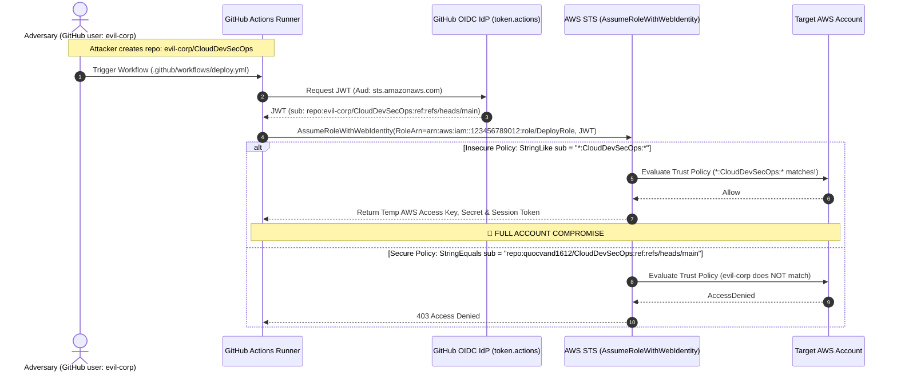

> [!IMPORTANT]
> Always anchor both the repository owner and specific branches/tags using `StringEquals` or tightly bounded `StringLike` patterns. Never allow wildcard prefixes in the repository path.

---

### Q1.2: Cryptographic Mechanics of Keyless Container Signing (Sigstore / Cosign)

**Scenario:** In workflow `02-build-scan-sign.yml`, we execute:
```bash
cosign sign --yes ghcr.io/quocvand1612/secure-api:latest
```

* **The Question:** No private key or password was provided to Cosign. Detail the exact 5-step cryptographic sequence involving the GitHub Actions OIDC provider, Fulcio Certificate Authority, Rekor Transparency Log, and the OCI Container Registry that makes this signature cryptographically verifiable by third parties without storing a long-lived private key.

#### 💡 Authoritative Master Answer & Architectural Analysis

The keyless container signing sequence relies on **ephemeral cryptographic keypairs and verifiable identity binding**:

1. **OIDC Identity Token Generation:** The GitHub Actions runner uses the GitHub Actions OIDC token provider to request a short-lived, digitally signed JWT containing verified metadata (`issuer: https://token.actions.githubusercontent.com`, `repository: quocvand1612/CloudDevSecOps`, `ref: refs/heads/main`, `sha: <commit-sha>`, `audience: sigstore`).
2. **In-Memory Ephemeral Keypair Generation:** Cosign generates an in-memory ECDSA P-256 (or Ed25519) keypair in the runner's RAM. The private key never touches disk and is zeroed out after signing.
3. **Fulcio Certificate Authority Exchange:** Cosign submits a Certificate Signing Request (CSR) with the public key and the OIDC JWT to **Fulcio** (Sigstore's public CA). Fulcio validates the JWT against GitHub's JWKS. Upon verification, Fulcio issues a short-lived (10-minute) X.509 code-signing certificate embedding the GitHub OIDC claims in the Subject Alternative Name (SAN) extension.
4. **Rekor Transparency Log Inclusion:** Cosign signs the container image digest using the ephemeral private key. It then sends the signature, public certificate, and artifact digest to **Rekor** (an immutable, append-only Merkle tree transparency log). Rekor records the entry and returns a Signed Entry Timestamp (SET) and inclusion proof.
5. **OCI Registry Bundle Publication & Verification:** Cosign publishes the signature, Fulcio X.509 certificate, and Rekor SET to the OCI container registry as a `.sig` artifact associated with the image digest. Verifiers (e.g., Kyverno or Cosign CLI) verify the signature by confirming the Fulcio certificate chain against Sigstore's trusted root and validating the Rekor inclusion proof—requiring zero stored private keys.

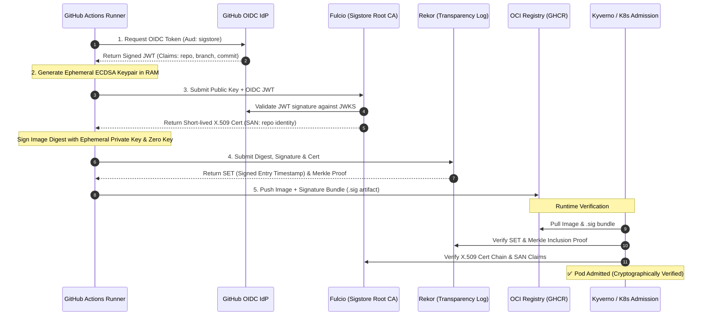

---

### Q1.3: STS `AssumeRoleWithWebIdentity` vs. `AssumeRole` Session Boundaries

**Scenario:** GitHub Actions requests credentials directly via AWS STS `AssumeRoleWithWebIdentity` rather than using standard AWS Access Keys.

* **The Question:** How does AWS STS validate the token signature without communicating with GitHub on every single API call? What role does the `.well-known/openid-configuration` and `jwks_uri` play? What is the maximum duration of an assumed session, and how can session tagging (`sts:TagSession`) be leveraged to enforce ABAC (Attribute-Based Access Control) in multi-branch CI/CD?

#### 💡 Authoritative Master Answer & Architectural Analysis

1. **Cryptographic Validation via Cached JWKS:**
   - AWS STS performs **local cryptographic verification** of incoming OIDC JWTs. It retrieves and caches the JSON Web Key Set (JWKS) from GitHub's discovery endpoint (`https://token.actions.githubusercontent.com/.well-known/openid-configuration` ➡️ `jwks_uri`).
   - When a workflow calls `AssumeRoleWithWebIdentity`, STS extracts the `kid` (Key ID) header from the token, selects the matching public RSA key from its internal cache, and verifies the RS256 signature in memory (<2 ms) without making an outbound HTTP request to GitHub per call.

2. **Session Limits:**
   - Sessions assumed via `AssumeRoleWithWebIdentity` can range from **900 seconds (15 minutes)** to **43,200 seconds (12 hours)**, bounded by the IAM role's `MaxSessionDuration` setting.
   - By contrast, transitive role chaining (e.g., assuming Role A then calling `sts:AssumeRole` for Role B) is strictly hard-limited to **1 hour (3,600 seconds)**.

3. **ABAC Enforcement via Session Tagging (`sts:TagSession`):**
   - GitHub Actions claims (`repository`, `ref`, `environment`) can be passed as transient session tags during role assumption.
   - An IAM trust policy combined with `sts:TagSession` allows dynamic policy evaluation:

```json
{
  "Version": "2012-10-17",
  "Statement": [
    {
      "Effect": "Allow",
      "Principal": { "Federated": "arn:aws:iam::123456789012:oidc-provider/token.actions.githubusercontent.com" },
      "Action": ["sts:AssumeRoleWithWebIdentity", "sts:TagSession"],
      "Condition": {
        "StringEquals": {
          "token.actions.githubusercontent.com:aud": "sts.amazonaws.com"
        }
      }
    }
  ]
}
```

- Target IAM policies can then enforce fine-grained ABAC conditions:
```json
{
  "Effect": "Allow",
  "Action": "s3:PutObject",
  "Resource": "arn:aws:s3:::prod-deployment-artifacts/*",
  "Condition": {
    "StringEquals": {
      "aws:PrincipalTag/ref": "refs/heads/main"
    }
  }
}
```

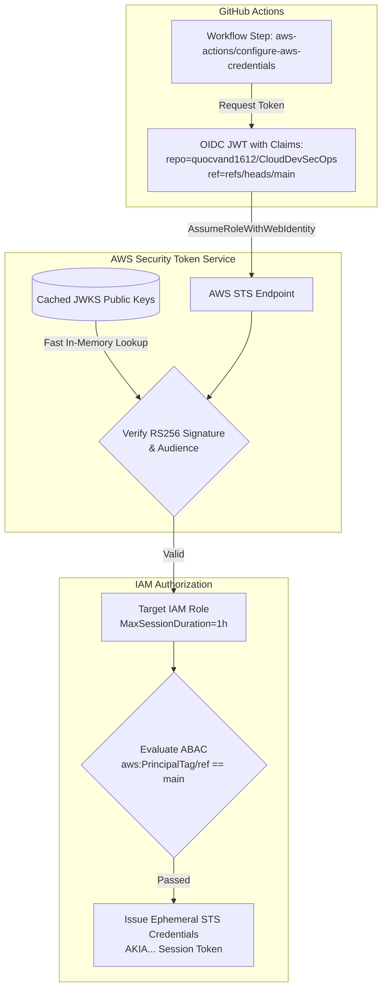

---

### Q1.4: The 2023 GitHub OIDC Thumbprint Outage & AWS IAM Root CA Validation

**Scenario:** In `terraform/bootstrap/main.tf`, we dynamically query thumbprints via `data.tls_certificate.github_actions`.

* **The Question:** What was the technical root cause of the widespread July 2023 GitHub Actions OIDC outage on AWS? Why did SHA-1 thumbprint pinning fail when GitHub rotated its intermediate TLS certificates? How did AWS modify IAM's backend OIDC validation logic to prevent future thumbprint rotation failures?

#### 💡 Authoritative Master Answer & Architectural Analysis

1. **Root Cause of the July 2023 Outage:**
   - AWS IAM OIDC identity providers historically required administrators to register the **SHA-1 thumbprint of the top intermediate TLS certificate** in the server's certificate chain.
   - When GitHub rotated its intermediate CA certificate (issued by DigiCert) during routine maintenance, the SHA-1 hash of the active intermediate certificate changed.
   - Because IAM checked incoming HTTPS connections against hardcoded thumbprints in the IAM OIDC configuration, AWS STS rejected incoming token requests with `OpenIDConnect provider HTTPS certificate doesn't match configured thumbprint`, breaking CI/CD pipelines worldwide.

2. **AWS Architectural Remediation:**
   - AWS updated the IAM OIDC validation subsystem to maintain an authoritative internal trust store of **global Root Certificate Authorities** (e.g., DigiCert Global Root CA, Let's Encrypt ISRG Root X1).
   - For verified major identity providers (GitHub, GitLab, Google, etc.), AWS IAM now validates the full X.509 certificate chain up to the trusted Root CA rather than relying on pinned intermediate SHA-1 thumbprints.
   - In modern Terraform, thumbprint arrays can include standard fallback hashes or root CA hashes without risk of rotation-induced outages.

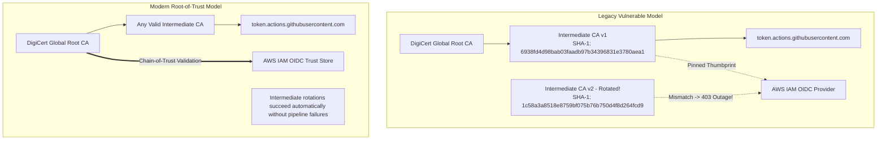

---

### Q1.5: Transitive Role Chaining & Privilege Escalation in CI/CD

**Scenario:** An attacker compromises a feature branch in a GitHub repository and can modify `.github/workflows/`.

* **The Question:** If the IAM role assumed by GitHub Actions has `iam:PassRole` permissions on EC2/Lambda roles without `iam:PassedToService` condition constraints, describe the exact step-by-step privilege escalation path the attacker could execute to gain full AdministratorAccess in the AWS account.

#### 💡 Authoritative Master Answer & Architectural Analysis

1. **Step-by-Step Privilege Escalation Path:**
   - **Step 1 (Branch Modification):** Attacker edits `.github/workflows/test.yml` on their feature branch and commits the change.
   - **Step 2 (Role Assumption):** The workflow runs and calls AWS STS `AssumeRoleWithWebIdentity` to obtain credentials for `arn:aws:iam::123456789012:role/GitHubActionsRole`.
   - **Step 3 (Target Role Discovery):** Attacker runs `aws iam list-roles` to identify high-privilege roles (e.g., `arn:aws:iam::123456789012:role/AdminExecutionRole` with `AdministratorAccess`).
   - **Step 4 (Malicious Resource Creation):** Because `iam:PassRole` has no service constraints, the attacker creates a new Lambda function embedding an administrative script:
     ```bash
     aws lambda create-function \
       --function-name PwnAdmin \
       --runtime python3.11 \
       --role arn:aws:iam::123456789012:role/AdminExecutionRole \
       --handler lambda_function.lambda_handler \
       --zip-file fileb://backdoor_admin.zip
     ```
   - **Step 5 (Execution & Escalation):** Attacker invokes the Lambda:
     ```bash
     aws lambda invoke --function-name PwnAdmin response.json
     ```
     The Lambda executes with `AdministratorAccess`, creating a backdoor IAM admin user or exfiltrating KMS keys.

2. **Remediation & Defense-in-Depth:**
   - **Enforce Service Constraints:** Attach `iam:PassedToService` condition keys:
     ```json
     "Condition": {
       "StringEquals": { "iam:PassedToService": "lambda.amazonaws.com" }
     }
     ```
   - **Resource Scoping:** Never use `"Resource": "*"` in `iam:PassRole`. Restrict resource ARNs strictly to specific execution roles.
   - **Branch Isolation:** Protect production roles by gating execution strictly on protected branches (`refs/heads/main`) using GitHub Environment protection rules.

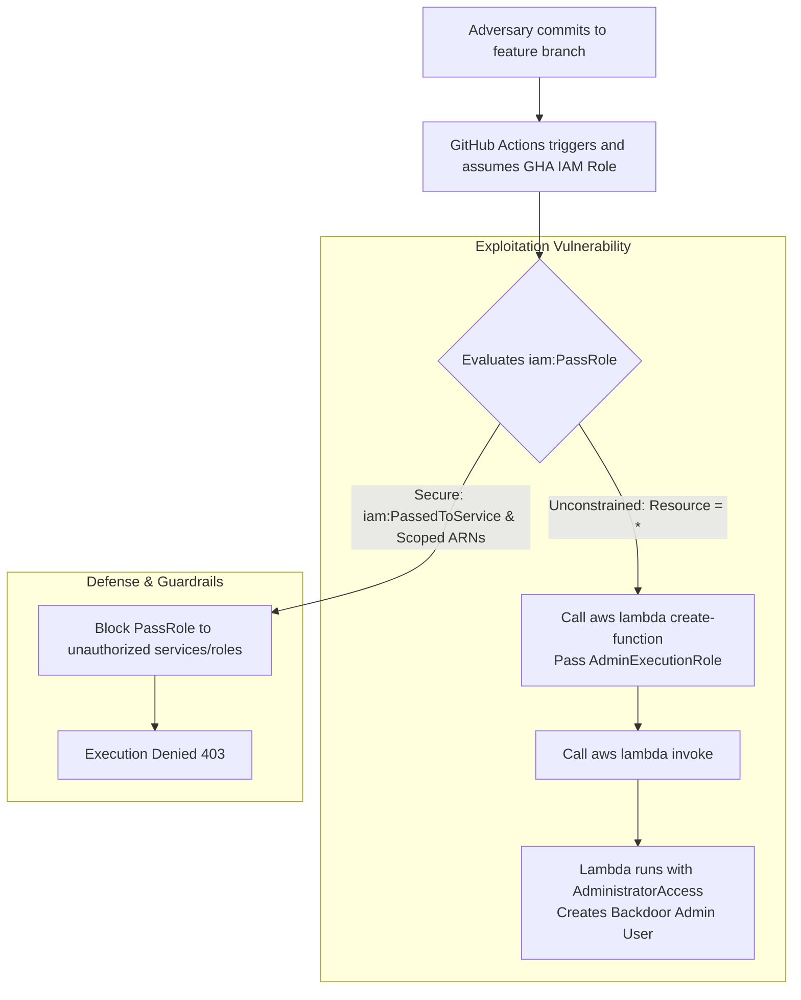

---

## 2. Cryptography, Envelope Encryption & Key Management

### Q2.1: Envelope Encryption Internals & Key Hierarchy

**Scenario:** Our RDS PostgreSQL database and EBS volumes are encrypted using a Customer Managed Key (CMK) in AWS KMS.

* **The Question:** Explain the exact mathematical lifecycle of a write operation to an encrypted PostgreSQL tablespace:
  1. How does RDS obtain the Data Encryption Key (DEK)?
  2. Where does the plaintext DEK reside in memory?
  3. Where is the encrypted DEK stored on disk?
  4. Why does AWS KMS never store or log the plaintext DEK?

#### 💡 Authoritative Master Answer & Architectural Analysis

1. **DEK Acquisition Lifecycle:**
   - When RDS/EBS initializes an encrypted volume or tablespace, the storage driver makes an authenticated API call to AWS KMS: `kms:GenerateDataKey(KeyId=CMK_ARN, KeySpec="AES_256")`.
   - KMS accesses its Hardware Security Module (HSM - FIPS 140-3 Level 3) where the root CMK resides. The HSM generates a cryptographically secure 256-bit random string (the DEK).
   - The HSM encrypts the DEK using the CMK. KMS returns a dual payload:
     - `PlaintextDataKey` (256-bit raw key)
     - `CiphertextBlob` (Encrypted DEK)

2. **Plaintext DEK in Memory:**
   - The plaintext DEK is loaded into the **volatile memory (RAM)** of the EC2 hypervisor / Nitro card / RDS storage controller.
   - Write operations execute hardware-accelerated **AES-256-GCM / AES-256-XTS** block cipher transformations in memory before flushing encrypted blocks to NVMe storage.
   - The plaintext DEK is sanitized (zeroed in memory) immediately upon volume dismount or database shutdown.

3. **Encrypted DEK Storage on Disk:**
   - The `CiphertextBlob` (encrypted DEK) is written directly into the **metadata header of the EBS volume / tablespace file** on persistent storage.

4. **Why KMS Never Stores Plaintext DEKs:**
   - **Security Boundary & Scalability:** KMS is a centralized key management and HSM authorization oracle, not a high-volume data encryption service. Storing plaintext DEKs would create a centralized honeypot and introduce network bottlenecks for high-throughput databases. Envelope encryption ensures the CMK never leaves the HSM, while offloading high-speed I/O encryption to the compute layer.

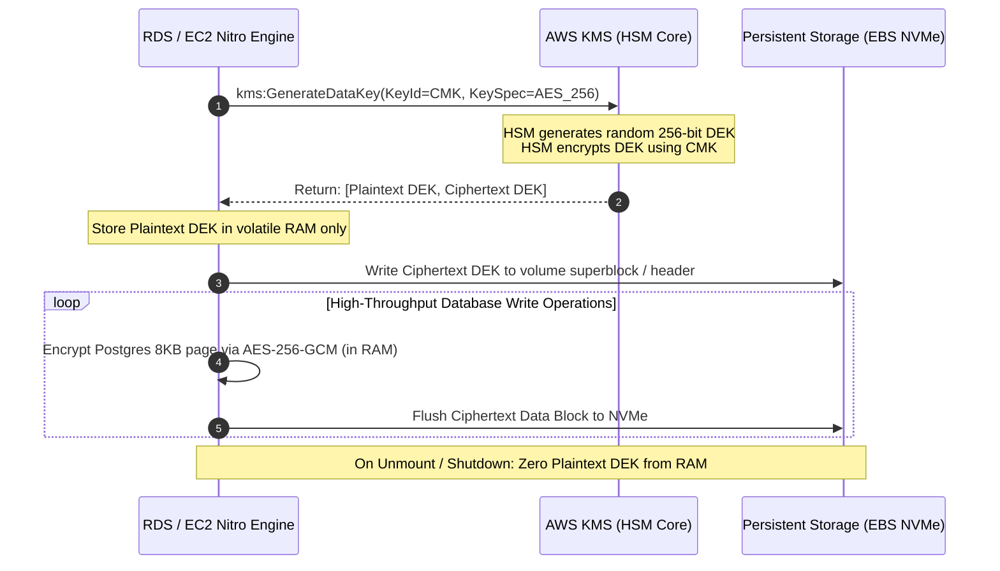

---

### Q2.2: Annual KMS Key Rotation vs. Data Re-encryption

**Scenario:** `aws_kms_key.primary` has `enable_key_rotation = true` (365-day rotation).

* **The Question:** When AWS KMS automatically rotates key material after 365 days:
  - Why does RDS PostgreSQL **NOT** need to re-encrypt existing gigabytes of table data on disk?
  - How does KMS decrypt historical data blocks written 2 years ago using older key material?
  - What is the difference between *Automatic Key Material Rotation* and *Manual Key Rotation with Key Aliases*?

#### 💡 Authoritative Master Answer & Architectural Analysis

1. **Why Re-Encryption Is Not Required:**
   - Envelope encryption decouples table data encryption from the KMS CMK. Data blocks are encrypted with Data Encryption Keys (DEKs).
   - The CMK is only used to encrypt and decrypt the DEKs. Rotating the CMK backing key material changes how *future* DEKs are encrypted, leaving existing DEKs and billions of underlying data blocks completely untouched.

2. **Historical Decryption Mechanics:**
   - When KMS rotates a key automatically, it creates a new **Key Material Version** inside the HSM (e.g., `Version 2`).
   - Historical key versions (`Version 1`) are retained in the HSM in a **read-only / decrypt-only state**.
   - Ciphertext DEK blobs contain metadata headers specifying the exact Key ID and Key Material Version used to encrypt them. When decrypting historical data, KMS automatically selects the corresponding backing key version.

3. **Automatic vs. Manual Key Rotation:**

| Attribute | Automatic Key Material Rotation | Manual Key Rotation with Key Aliases |
| :--- | :--- | :--- |
| **Key ARN** | **Unchanged** (`arn:aws:kms:...:key/abc-123`) | **Changes** (`...:key/xyz-789` created) |
| **Code / Config Impact** | Zero (completely transparent to IAM and apps) | Must update Key Aliases (`alias/app-key`) or ARNs |
| **Historical Decryption** | Built-in (KMS retains previous backing versions) | Manual (must preserve old KMS keys forever) |
| **Rotation Period** | 90 to 2,560 days (configurable, default 365) | On-demand whenever new key is provisioned |

```mermaid
graph TD
    subgraph KMS HSM Key Store
        CMK[CMK: arn:aws:kms:...:key/abc-123]
        V1[Key Material v1 - 2024\n(Decrypt Only)]
        V2[Key Material v2 - 2025\n(Active Encrypt/Decrypt)]
        CMK --> V1
        CMK --> V2
    end

    subgraph Storage Layer
        D1[2024 Data Block\nEncrypted with DEK-1]
        H1[DEK-1 Header\nEncrypted with CMK v1]
        
        D2[2025 Data Block\nEncrypted with DEK-2]
        H2[DEK-2 Header\nEncrypted with CMK v2]
    end

    H1 -->|Route to v1| V1
    H2 -->|Route to v2| V2
```

---

### Q2.3: IAM Database Authentication vs. Secrets Manager Rotation

**Scenario:** Our RDS instance has `iam_database_authentication_enabled = true`.

* **The Question:**
  1. Contrast the security architecture of IAM Database Authentication with AWS Secrets Manager password rotation.
  2. How does the PostgreSQL server validate an IAM authentication token when PostgreSQL itself does not have native AWS IAM credentials?
  3. Why does IAM DB Auth have a connection rate limit (200 connections/sec) and how do connection pools (e.g., PgBouncer / RDS Proxy) interact with ephemeral tokens?

#### 💡 Authoritative Master Answer & Architectural Analysis

1. **Architectural Comparison:**
   - **Secrets Manager Rotation:** Relies on long-lived passwords stored in a centralized vault. A rotation Lambda periodically connects to the database via administrative credentials, issues `ALTER USER ... PASSWORD '...'`, and updates the vault. Applications must poll Secrets Manager and handle password refresh caching.
   - **IAM Database Authentication:** Completely **passwordless**. Clients request temporary credentials via AWS STS and generate a cryptographically signed AWS SigV4 authorization token (valid for 15 minutes), passed as the DB password.

2. **Validation Mechanism without Native IAM in Postgres:**
   - RDS PostgreSQL is bundled with an AWS-engineered PAM (Pluggable Authentication Module) plugin: `rds_iam`.
   - When a client connects with an IAM token, PostgreSQL forwards the token to the local RDS management daemon running inside the RDS hypervisor envelope.
   - The RDS daemon validates the SigV4 cryptographic signature against AWS STS public signing certificates locally. If the signature and role identity are valid, PostgreSQL admits the user under the mapped database role (`GRANT rds_iam TO db_user`).

3. **Connection Rate Limits & Connection Pooling:**
   - **200 connections/sec limit:** SigV4 token validation requires compute-heavy asymmetric cryptographic signature verification for every single TCP handshake.
   - **Pooling Integration:** Ephemeral tokens expire in 15 minutes. To avoid connection thrashing:
     - **RDS Proxy:** Maintains persistent, long-lived backend connections to PostgreSQL while validating client IAM tokens at the proxy edge, completely insulating the database engine from connection overhead.

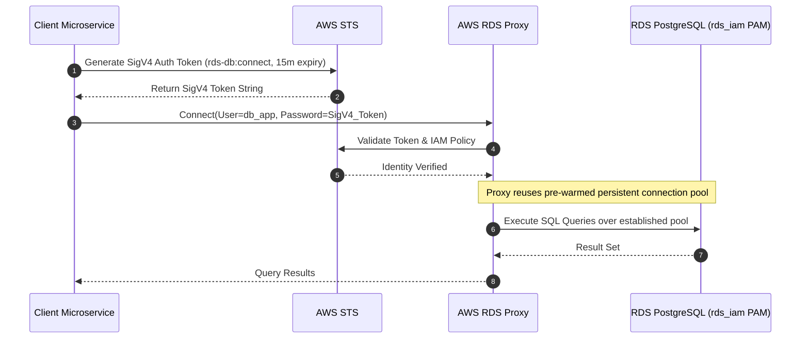

---

### Q2.4: KMS Key Policy vs. IAM Policy Evaluation Logic

**Scenario:** In `terraform/modules/kms/main.tf`, the key policy contains:
```json
{
  "Sid": "EnableRootPermissions",
  "Effect": "Allow",
  "Principal": { "AWS": "arn:aws:iam::ACCOUNT_ID:root" },
  "Action": "kms:*",
  "Resource": "*"
}
```

* **The Question:** Why is this specific statement mandatory in AWS KMS? What happens if you remove this statement and only grant KMS permissions to IAM roles via standard IAM Policies? What is the dual-evaluation rule in AWS KMS?

#### 💡 Authoritative Master Answer & Architectural Analysis

1. **Why the Root Statement is Mandatory:**
   - AWS KMS operates on a **Dual-Evaluation Model**. Unlike S3 or SQS where IAM policies alone can grant access, a KMS Key Policy is the **primary, sovereign authorization boundary**.
   - By default, IAM policies have **zero authority** over a KMS key unless the Key Policy explicitly delegates access to the account via `Principal: { "AWS": "arn:aws:iam::ACCOUNT_ID:root" }`.
   - The `"root"` principal refers to the AWS account itself (not the root user), enabling the account administrator to delegate KMS permissions using IAM policies.

2. **The "Orphaned Key" Disaster:**
   - If you remove this statement and the Key Policy only lists a specific IAM role (e.g., `role/DeployerRole`), deleting that role leaves the KMS key permanently **orphaned**.
   - Neither account administrators nor IAM policies can modify or decrypt with the key. Recovery requires contacting AWS Support to manually delete or reset the key.

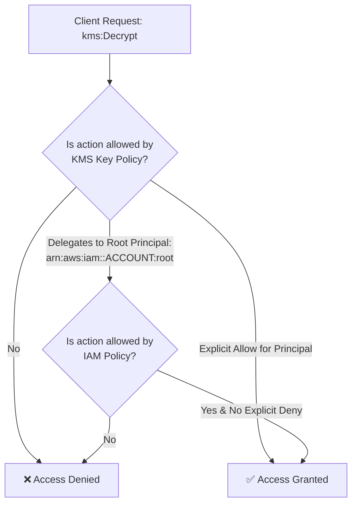

---

### Q2.5: High-Entropy Dynamic Passwords vs. Terraform State Exposure

**Scenario:** `terraform/modules/rds-postgres/main.tf` uses `resource "random_password"` with `special = true`.

* **The Question:** While `random_password` eliminates hardcoded plaintext in Git, where does the generated password get stored in plaintext? What specific security controls must be applied to the S3 remote backend bucket, DynamoDB lock table, and CI/CD runner memory to prevent credential harvesting from Terraform state files?

#### 💡 Authoritative Master Answer & Architectural Analysis

1. **Plaintext Storage in State:**
   - Terraform manages resources declaratively and must track the exact attributes of managed resources. Consequently, `random_password.result` is stored in **unencrypted plaintext JSON** inside the remote `terraform.tfstate` file.

2. **Mandatory Multi-Layer State Security Architecture:**
   - **S3 State Bucket Encryption:** Enforce Server-Side Encryption using AWS KMS Customer Managed Keys (`aws:kms`) with access restricted strictly to deployment IAM roles.
   - **Enforce In-Transit Encryption:** Enforce a bucket policy denying all requests without TLS (`aws:SecureTransport == false`).
   - **Object Versioning & MFA Delete:** Enable S3 Versioning and MFA Delete to prevent malicious destruction of state history.
   - **DynamoDB State Lock Security:** Enable KMS encryption at rest and Point-in-Time Recovery (PITR) on the DynamoDB state locking table.
   - **CI/CD Ephemeral Runner Sanitation:** Ensure self-hosted runners run in ephemeral containers that destroy their filesystem and scratch storage immediately upon workflow termination.
   - **Native Secrets Manager Generation Alternative:** Best practice is to use `aws_secretsmanager_secret_version` with native AWS-managed generation, preventing the secret from ever touching Terraform state.

```mermaid
flowchart LR
    subgraph CI/CD Runner
        TF[Terraform CLI]
        STATE[terraform.tfstate\n(Plaintext Passwords in JSON)]
    end

    subgraph AWS Security Controls
        S3[S3 Remote Backend\n- SSE-KMS CMK\n- TLS Enforced\n- IAM OIDC Only]
        DDB[DynamoDB Lock Table\n- KMS Encrypted\n- PITR Enabled]
        KMS[AWS KMS HSM]
    end

    TF -->|1. Acquire Lock| DDB
    TF -->|2. Encrypt & Upload State| S3
    S3 <-->|Envelope Encryption| KMS
```

---

## 3. Network Security, Perimeter Defense & Edge Microsegmentation

### Q3.1: CloudFront to ALB Origin Verification Security Limitations

**Scenario:** Our ALB drops direct requests and verifies requests from CloudFront via the `X-Origin-Verify` custom header.

* **The Question:**
  - What are the architectural attack vectors of using static secret header verification (`X-Origin-Verify`) compared to true mutual TLS (mTLS) or AWS VPC Lattice / PrivateLink?
  - If an attacker discovers the public IP of the ALB (`52.220.104.84`) and guesses or extracts the `X-Origin-Verify` token (e.g., from CloudFront request logs or an SSRF leak), how can they bypass CloudFront WAF entirely?
  - How can you architect a zero-trust origin that makes direct ALB ingress mathematically impossible without mTLS?

#### 💡 Authoritative Master Answer & Architectural Analysis

1. **Vulnerabilities of Static Secret Headers (`X-Origin-Verify`):**
   - **Bearer Token Vulnerability:** A static header is a bearer token without cryptographic nonces or client binding. Anyone possessing the string can forge requests.
   - **Leakage Vectors:** Log files (CloudFront access logs, ALB access logs, proxy logs), CI/CD environment variable leaks, backend application debug logs, or Server-Side Request Forgery (SSRF) vulnerabilities that reflect incoming headers.

2. **Bypass Mechanism:**
   - An attacker identifies the public ALB IP (via DNS history or Shodan/Censys port scanning) and sends direct requests:
     ```bash
     curl -H "Host: api.example.com" -H "X-Origin-Verify: <leaked-secret>" https://52.220.104.84/admin/delete
     ```
   - The ALB evaluates the header, matches the static secret, and routes traffic directly to the backend—**completely bypassing CloudFront WAF rate limiting, managed OWASP rules, and geo-restrictions**.

3. **Zero-Trust Private Origin Architectures:**
   - **CloudFront VPC Origins (PrivateLink):** The ALB is provisioned in **private subnets with zero public IP addresses**. CloudFront connects directly to the private ALB via AWS PrivateLink VPC endpoints. Direct internet ingress is physically impossible at the network routing layer.
   - **AWS CloudFront Managed Prefix List:** Attach AWS Managed Prefix List (`pl-58a04031` - `com.amazonaws.global.cloudfront.origin-facing`) to the ALB Security Group, dropping all non-CloudFront IP packets at the Nitro hypervisor boundary.

```mermaid
flowchart TD
    subgraph Vulnerable Public Ingress
        A1[Attacker] -->|Direct HTTP + Leaked Header| ALB1[Public ALB: 52.220.104.84]
        ALB1 -->|WAF Bypassed!| BE1[Backend Microservices]
    end

    subgraph Zero-Trust Private Ingress (PrivateLink)
        User[Legitimate User] --> CF[CloudFront Edge + WAFv2]
        CF -->|AWS PrivateLink / VPC Origin| EP[VPC Endpoint]
        EP --> ALB2[Private ALB\nNo Public IP / Private Subnet]
        ALB2 --> BE2[Backend Microservices]
        A2[Attacker] -.->|Direct Ingress Impossible - No Route| ALB2
    end
```

---

### Q3.2: `fck-nat` Linux Kernel NAT vs. AWS Managed NAT Gateway

**Scenario:** We replaced the $32/mo AWS Managed NAT Gateway with `fck-nat` running on a Graviton `t4g.nano` Spot instance.

* **The Question:**
  1. What is the fundamental difference in network throughput, connection concurrency, and failover behavior between an EC2 Linux kernel `iptables` NAT router and an AWS Hypervisor-managed NAT Gateway?
  2. What happens to `fck-nat` when the Linux conntrack table (`/proc/sys/net/netfilter/nf_conntrack_max`) is exhausted by a high-frequency outbound microservice?
  3. How does EC2 Spot interruption handling affect outbound egress traffic, and how would you architect an active-active HA `fck-nat` cluster in Terraform?

#### 💡 Authoritative Master Answer & Architectural Analysis

1. **Architectural Comparison:**
   - **AWS Managed NAT Gateway:** A serverless, hypervisor-distributed NAT fabric scaling automatically up to **100 Gbps** per AZ. It operates with AWS-managed multi-AZ resilience and zero connection tracking state bottlenecks.
   - **`fck-nat` EC2 Instance:** A single virtual machine using Linux kernel `iptables` / `nftables` masquerading. Bandwidth is bounded by the EC2 network tier (up to 5 Gbps burst on `t4g.nano`), and CPU/memory limits dictate packet forwarding rates.

2. **Linux Conntrack Table Exhaustion:**
   - Linux `netfilter` tracks every outbound TCP/UDP session in `/proc/net/nf_conntrack`.
   - On small instances (`t4g.nano` with 512MB RAM), `nf_conntrack_max` defaults to ~65,536 entries.
   - When exhausted by high-frequency outbound API calls or connection leaks, the Linux kernel drops all new outgoing SYN packets with: `nf_conntrack: table full, dropping packet`. All private workloads immediately lose outbound internet connectivity.

3. **Spot Interruption & High-Availability Architecture:**
   - Spot instances receive a 2-minute termination notice (`EC2 Spot Instance Interruption Warning`).
   - **Production HA Architecture:** Deploy two `fck-nat` instances in separate AZs (AZ-A and AZ-B) with distinct Elastic Network Interfaces (ENIs). Use EventBridge matching Spot interruption warnings to trigger an AWS Lambda function that re-points private subnet route tables (`0.0.0.0/0`) to the healthy standby ENI in <5 seconds.

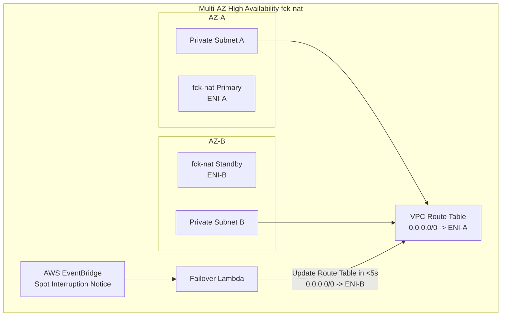

---

### Q3.3: AWS Transit Gateway (TGW) Appliance Mode in Multi-AZ Security Hubs

**Scenario:** In our Production Architecture (`terraform/environments/prod`), we specify a centralized Inspection VPC with Transit Gateway.

* **The Question:**
  - What is **TGW Appliance Mode**, and why is it strictly required when routing traffic through stateful firewalls/NATs across multiple Availability Zones?
  - Describe the "Asymmetric Routing Problem" that occurs in AWS when Appliance Mode is disabled on VPC attachments.

#### 💡 Authoritative Master Answer & Architectural Analysis

1. **What is TGW Appliance Mode:**
   - Transit Gateway Appliance Mode is a VPC attachment configuration that forces TGW to direct both forward (SYN) and return (SYN-ACK / ACK) packets of a single network flow to the **same Elastic Network Interface (ENI) in the same Availability Zone**.

2. **The Asymmetric Routing Problem:**
   - Without Appliance Mode, TGW selects VPC attachment ENIs using equal-cost multi-path (ECMP) hashing based only on source/destination IP pairs, disregarding return path symmetry.
   - If Workload VPC AZ-1 sends a TCP SYN packet through TGW to Firewall A in Inspection VPC AZ-1, the firewall creates a state table entry.
   - When the target server in Workload VPC AZ-2 sends the TCP SYN-ACK return packet back through TGW, TGW may hash the return flow to Firewall B in Inspection VPC AZ-2.
   - Because Firewall B never saw the initial SYN packet, its stateful inspection engine classifies the SYN-ACK packet as an invalid state violation and **drops the packet**, breaking TCP connections.

```mermaid
flowchart TD
    subgraph Without Appliance Mode (Broken Asymmetric Flow)
        SRC1[Client in AZ-1] -->|1. TCP SYN| TGW1[Transit Gateway]
        TGW1 -->|2. Route to AZ-1| FW_A[Firewall A (AZ-1)\nState: SYN Seen]
        FW_A -->|3. Forward| DST1[Server in AZ-2]
        DST1 -->|4. TCP SYN-ACK| TGW1
        TGW1 -->|5. Hash Route to AZ-2!| FW_B[Firewall B (AZ-2)\nNo State Table Entry!]
        FW_B -->|❌ Packet Dropped!| DROP[Connection Reset / Drop]
    end

    subgraph With Appliance Mode (Symmetric Flow)
        SRC2[Client in AZ-1] -->|1. TCP SYN| TGW2[Transit Gateway + Appliance Mode]
        TGW2 -->|2. Sticky Route AZ-1| FW2[Firewall A (AZ-1)]
        FW2 -->|3. Forward| DST2[Server in AZ-2]
        DST2 -->|4. TCP SYN-ACK| TGW2
        TGW2 -->|5. Guaranteed Sticky Route to AZ-1| FW2
        FW2 -->|6. Valid State Handshake| SRC2
    end
```

---

### Q3.4: Network Security Group Chaining & Circular References

**Scenario:** Our security groups are strictly chained:
- `ALB SG` allows 80/443 from allowed client CIDRs.
- `Compute SG` allows port 8080 ONLY from `ALB SG` (`source_security_group_id`).
- `Database SG` allows port 5432 ONLY from `Compute SG`.

* **The Question:**
  1. What happens at the network virtualization layer when an EC2 instance in `Compute SG` is compromised and attempts to connect to another instance in the same `Compute SG`?
  2. Why is referencing Security Group IDs superior to referencing subnet CIDR blocks in Zero-Trust environments?
  3. What is the limit of chained security group rules in AWS and how does cross-account SG referencing work across VPC Peering?

#### 💡 Authoritative Master Answer & Architectural Analysis

1. **Intra-Security Group Isolation:**
   - Security Groups in AWS are **deny-all by default** and operate at the hypervisor ENI layer (AWS Nitro System).
   - Being assigned to the same Security Group (`Compute SG`) does **not** grant instances permission to communicate with each other. Unless an explicit self-referencing rule (`source = sg-compute`) is added, all lateral movement between compute instances is dropped by the hypervisor.

2. **SG ID Referencing vs. Subnet CIDR:**
   - **Subnet CIDRs:** Grant network access based on static IP blocks. If a rogue instance, compromised test box, or unapproved Lambda ENI is provisioned inside the subnet, it automatically inherits network reachability.
   - **Security Group IDs:** Enforce **cryptographic identity-based microsegmentation**. Nitro validates the ENI attachment metadata, ensuring only specifically authorized workloads can communicate regardless of subnet IP allocation or IP reassignment.

3. **Limits & Cross-VPC Peering:**
   - **Limits:** By default, 60 inbound and 60 outbound rules per SG (max 1,000 per ENI across combined SGs).
   - **Cross-Account VPC Peering:** Referencing Security Groups across peered VPCs in the same AWS Region is fully supported using the format `ACCOUNT_ID/sg-xxxxxxxx`. (Note: SG referencing is not supported across Transit Gateway or inter-region peering).

```mermaid
flowchart LR
    subgraph Ingress Edge
        INET((Internet)) -->|80/443| ALB_SG[ALB Security Group\nsg-alb]
    end

    subgraph Compute Tier (Private Subnet)
        ALB_SG -->|8080| COMP_1[Compute Node 1\nsg-compute]
        COMP_1 -.->|❌ Blocked by Nitro Hypervisor\nNo Self-Ref Rule| COMP_2[Compute Node 2\nsg-compute]
    end

    subgraph Data Tier (Isolated Subnet)
        COMP_1 -->|5432| DB_SG[(RDS Postgres\nsg-database)]
        INET -.->|❌ No Route / No SG Rule| DB_SG
    end
```

---

### Q3.5: AWS WAFv2 Rule Evaluation Order & Regex Performance Denial of Service (ReDoS)

**Scenario:** Regional WAFv2 is attached to our public ingress.

* **The Question:**
  - In what exact order does AWS WAFv2 process WebACL rules (e.g., Rate Limiting vs IP Whitelisting vs AWS Managed Core Rule Set vs Custom Regex)?
  - How can a malicious actor exploit algorithmic complexity in poorly structured custom regex rules in AWS WAF to cause latency degradation or rule evaluation bypasses?

#### 💡 Authoritative Master Answer & Architectural Analysis

1. **AWS WAFv2 Rule Evaluation Hierarchy:**
   - Rules are evaluated **sequentially in order of Priority integer (0, 1, 2, ...)**:
     - **Terminating Rules (`BLOCK`, `ALLOW`):** Immediately halts all further rule processing and executes the action.
     - **Non-Terminating Rules (`COUNT`, `CAPTCHA` on success):** Logs/counts and proceeds to the next priority rule.
   - **Architectural Best Practice Order:**
     1. *Priority 0:* IP Allowlist / Blocklist (Fastest drop of known malicious CIDRs).
     2. *Priority 1:* Rate Limiting (Shield against volumetric L7 floods).
     3. *Priority 2:* AWS Managed Rules (Core Rule Set / Known Bad Inputs).
     4. *Priority 3:* Custom Application Regex & SQLi/XSS inspection.
     5. *Default Action:* `ALLOW` (or `BLOCK` for strict zero-trust).

2. **Regex Denial of Service (ReDoS) & Body Truncation Bypass:**
   - **ReDoS Vulnerability:** Poorly structured regular expressions containing nested quantifiers (e.g., `(a+)+$`, `([a-zA-Z0-9_]+)*$`) exhibit $O(2^n)$ exponential backtracking complexity. An attacker sending crafted strings causes high CPU utilization in regex engines. AWS WAF mitigates this with strict internal execution limits (10,000 regex steps), terminating evaluation with an error action if exceeded.
   - **Body Truncation Bypass:** AWS WAF inspects up to **16 KB (default) or 64 KB** of the request body. Attackers pad request payloads with 65 KB of benign whitespace before injecting malicious SQLi/XSS payloads. To mitigate, configure `oversize_handling: "BLOCK"`.

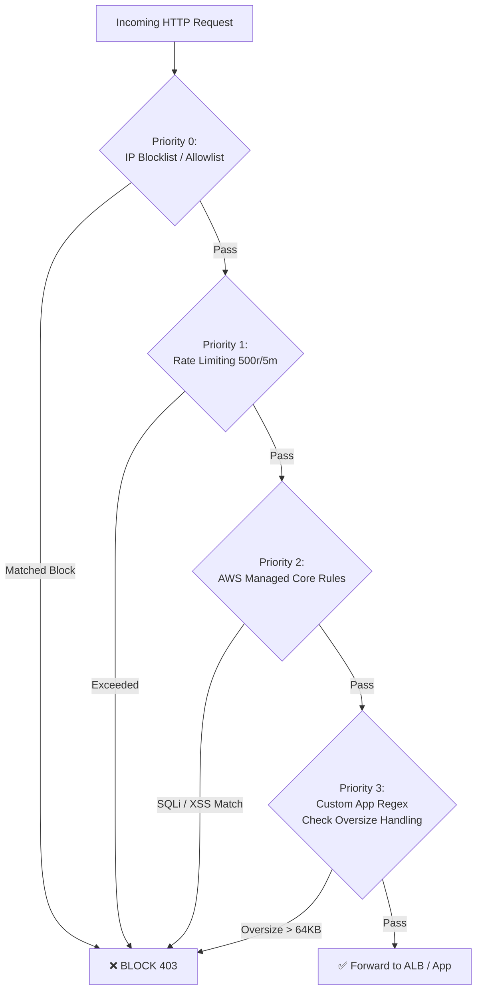

---

## 4. Container Runtime Defense, Kubernetes & eBPF Security

### Q4.1: IMDSv2 Hop Limit = 1 and SSRF Container Defense

**Scenario:** In `terraform/modules/k3s-lab-node/main.tf`, we enforce:
```hcl
metadata_options {
  http_endpoint               = "enabled"
  http_tokens                 = "required"
  http_put_response_hop_limit = 1
}
```

* **The Question:**
  1. Explain the exact networking difference between standard bridge networking (`cbr0` / container veth pairs) and host networking (`hostNetwork: true`) regarding IP packet TTL.
  2. Why does setting `http_put_response_hop_limit = 1` mathematically prevent a container running inside a Kubernetes pod from obtaining the IMDSv2 token via an SSRF vulnerability in the application?
  3. If an attacker tricks a pod into using `hostNetwork: true`, does Hop Limit = 1 protect the node credentials? Why or why not?

#### 💡 Authoritative Master Answer & Architectural Analysis

1. **Bridge vs. Host Networking IP TTL Mechanics:**
   - **Bridge Networking (`cbr0` / `veth`):** The pod exists in a separate Linux network namespace (`netns`). Packets traveling between the container and the host traverse a virtual Ethernet pair and bridge, crossing a Layer 3 routing boundary. The Linux IP stack **decrements the IPv4 TTL (Time-To-Live) by 1**.
   - **Host Networking (`hostNetwork: true`):** The pod shares the host's root network namespace. Packets originate directly on the host's network interfaces without traversing a bridge or decrementing TTL.

2. **How Hop Limit = 1 Prevents SSRF Exploitation:**
   - The EC2 Instance Metadata Service is reached via link-local address `169.254.169.254`.
   - With `http_put_response_hop_limit = 1`, the IMDS daemon sends the response packet containing the session token with an IP TTL header of **1**.
   - When the host kernel routes this response packet across the bridge (`cbr0`) to the container's `veth`, the kernel decrements the TTL from 1 to **0**.
   - Because TTL=0 packets cannot be forwarded, the kernel drops the packet (`TTL expired in transit`). The container application's SSRF payload receives a connection timeout and never gets the IMDSv2 token!

3. **The `hostNetwork: true` Loophole:**
   - **No, Hop Limit = 1 does NOT protect hostNetwork pods.** Because hostNetwork pods do not traverse a bridge, the TTL is not decremented. The pod communicates directly with IMDS on loopback/host interface.
   - **Mitigation:** Enforce Kyverno / Pod Security Standards to strictly prohibit `hostNetwork: true` in non-system namespaces.

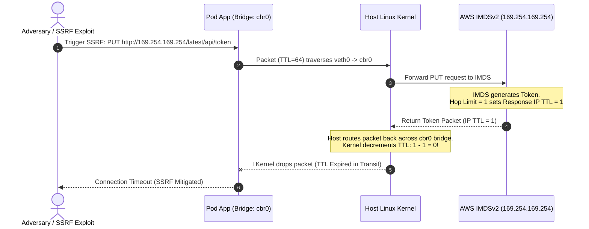

---

### Q4.2: Distroless Non-Root Containers & Linux Capability Dropping

**Scenario:** Our Go microservice uses `gcr.io/distroless/static-debian12:nonroot` with UID 65532 and `capabilities.drop = ["ALL"]`.

* **The Question:**
  - What attack vectors are eliminated by running a distroless container compared to Alpine/Ubuntu base images (e.g., absence of package managers, shells, glibc vulnerabilities)?
  - If a container drops `CAP_NET_RAW`, what specific internal container network attacks (e.g., ARP spoofing, packet sniffing) are prevented?
  - Can a process running as non-root (UID 65532) still exploit a Linux kernel privilege escalation vulnerability (e.g., Dirty COW, Dirty Pipe)? How do `seccompProfile: RuntimeDefault` and AppArmor restrict kernel syscall surface area?

#### 💡 Authoritative Master Answer & Architectural Analysis

1. **Attack Surface Elimination via Distroless:**
   - **No Shells (`/bin/sh`, `/bin/bash`):** Eliminates classic command injection reverse shells (`/bin/sh -i >& /dev/tcp/...`).
   - **No Package Managers (`apt`, `apk`):** Prevents attackers from installing post-exploitation tools (`curl`, `nmap`, `gcc`, `netcat`).
   - **Zero C Runtime / glibc:** Static distroless images contain only the compiled binary and root CA certs, immunizing the image from `glibc` memory corruption CVEs (e.g., Looney Tunables).

2. **Dropping `CAP_NET_RAW`:**
   - Prevents the process from binding to raw sockets (`SOCK_RAW`, `AF_PACKET`).
   - Blocks ARP cache poisoning (MITM attacks against peer pods on the same node), ICMP packet forging, and promiscuous network sniffing (`tcpdump`) within the pod namespace.

3. **Kernel Privilege Escalation & Seccomp Defense:**
   - **Non-Root is Not an Absolute Kernel Boundary:** Even non-root processes share the host Linux kernel. Vulnerabilities like Dirty Pipe (CVE-2022-0847) exploit flaws in kernel pipe buffers via standard system calls (`splice`, `pipe`).
   - **Seccomp & AppArmor Role:** `seccompProfile: RuntimeDefault` disables over 60 high-risk system calls (e.g., `ptrace`, `bpf`, `kexec_load`, `clone3` with raw flags, `process_vm_writev`), drastically limiting the syscall surface area required to execute kernel privilege escalation exploits.

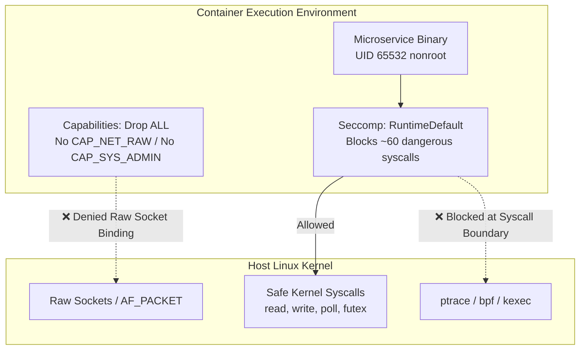

---

### Q4.3: eBPF-Based CNI (Cilium) vs. iptables/Netfilter Performance & Security

**Scenario:** The production architecture deploys Cilium eBPF CNI for Kubernetes networking and security policy.

* **The Question:**
  1. How does Cilium use eBPF programs attached to Linux socket layers (`sockops`) and TC (Traffic Control) hooks to bypass the `kube-proxy` iptables sequential rule traversal?
  2. How does Cilium enforce **Layer 7 HTTP filtering** (e.g., allowing only `GET /healthz` and blocking `POST /admin`) without injecting an intrusive Envoy sidecar proxy into every application pod?
  3. Describe how Cilium's identity-based security policies (`CiliumNetworkPolicy`) prevent IP-spoofing attacks inside a multi-tenant Kubernetes cluster.

#### 💡 Authoritative Master Answer & Architectural Analysis

1. **eBPF vs. iptables Sequential Traversal:**
   - **`kube-proxy` (iptables Mode):** Evaluates $O(N)$ sequential packet filtering rules per packet. In a cluster with 5,000 services, thousands of iptables chains must be evaluated, incurring significant CPU overhead and latency.
   - **Cilium eBPF:** Replaces `kube-proxy` entirely. Cilium attaches eBPF bytecode programs to Linux kernel hooks (XDP, TC ingress/egress, and socket layers `sockops`). Packet routing and NAT lookups are executed as **$O(1)$ constant-time hash map lookups in kernel memory**, achieving line-rate packet forwarding.

2. **Sidecarless Layer 7 HTTP Filtering:**
   - Traditional service meshes (Istio/Linkerd) require injecting an Envoy sidecar proxy container into every application pod.
   - Cilium runs a **node-level Envoy proxy**. Using eBPF socket redirection (`sockmap` / `sk_msg`), Cilium intercepts application TCP streams directly in the kernel socket layer and selectively redirects only traffic requiring L7 inspection to the shared node Envoy instance. Non-L7 traffic is forwarded purely at L3/L4 in eBPF, eliminating 80% of sidecar proxy CPU/memory overhead.

3. **Cryptographic Identity-Based Security vs. IP Spoofing:**
   - Cilium assigns a numeric **Security Identity** (e.g., Identity `4096`) to pods based on verified Kubernetes labels.
   - eBPF programs tag every outgoing packet with this numeric identity in the packet encapsulation header (VXLAN/Geneve) or BPF context.
   - Receiving nodes validate the embedded Security Identity in the eBPF TC hook. If a compromised container spoofs its IP address, the eBPF layer rejects the packet because the cryptographic identity tag does not match the node's local BPF identity map.

```mermaid
flowchart LR
    subgraph Legacy kube-proxy iptables
        P1[Pod A] --> KERNEL1[Linux Netfilter]
        KERNEL1 --> SEQ[Sequential iptables Chain\nRule 1 -> Rule 2 -> ... -> Rule 10,000\nO(N) Traversal Latency]
        SEQ --> P2[Pod B]
    end

    subgraph Cilium eBPF Architecture
        P3[Pod A] --> SOCK[eBPF Socket Hook sockops]
        SOCK --> BPF_MAP[(BPF Identity Map\nO(1) Hash Lookup)]
        BPF_MAP --> DIRECT[Direct Kernel Forwarding]
        DIRECT --> P4[Pod B]
    end
```

---

### Q4.4: Kyverno Admission Control vs. Kubernetes Built-in Pod Security Standards (PSS)

**Scenario:** We enforce security policies using Kyverno Policy-as-Code manifests in `k8s/kyverno/`.

* **The Question:**
  - What are the operational and security differences between Kubernetes native **Pod Security Standards (Privileged / Baseline / Restricted)** and a dynamic Admission Controller like **Kyverno**?
  - What is the security implication of setting Kyverno webhook `failurePolicy: Ignore` vs `failurePolicy: Fail` during a control plane outage or admission webhook timeout?
  - How can Kyverno mutate incoming pods on-the-fly to automatically inject security contexts (e.g., `readOnlyRootFilesystem: true`) without developer intervention?

#### 💡 Authoritative Master Answer & Architectural Analysis

1. **PSS vs. Kyverno Comparison:**
   - **Pod Security Standards (PSS):** A static, built-in Kubernetes admission feature applied per-namespace via labels (`pod-security.kubernetes.io/enforce: restricted`). It offers only 3 coarse profiles (Privileged, Baseline, Restricted) with no support for mutation, custom fine-grained conditions, or external image signature verification.
   - **Kyverno:** A dynamic, declarative Kubernetes Policy-as-Code engine supporting fine-grained validation, mutation, generation of default resources, and native **Sigstore Cosign image signature verification**.

2. **`failurePolicy: Ignore` vs. `Fail`:**
   - **`failurePolicy: Ignore` (Availability over Security):** If the Kyverno admission webhook pod is unreachable or times out, Kubernetes **admits the pod anyway**. Risk: An attacker can flood or crash the Kyverno pod, then deploy unvetted privileged cryptomining containers.
   - **`failurePolicy: Fail` (Security over Availability - Fail Closed):** Rejects all pod creation requests if Kyverno cannot be reached. In production security environments, `Fail` is mandatory, backed by running 3 high-availability replicas of Kyverno across multiple nodes.

3. **Automatic Security Context Mutation:**
   - Kyverno uses mutation rules with JSON patches to inject required security configurations automatically:

```yaml
apiVersion: kyverno.io/v1
kind: ClusterPolicy
metadata:
  name: auto-inject-security-context
spec:
  rules:
    - name: mutate-security-context
      match:
        any:
          - resources:
              kinds: ["Pod"]
      mutate:
        patchStrategicMerge:
          spec:
            securityContext:
              runAsNonRoot: true
            containers:
              - name: "*"
                securityContext:
                  readOnlyRootFilesystem: true
                  allowPrivilegeEscalation: false
                  capabilities:
                    drop: ["ALL"]
```

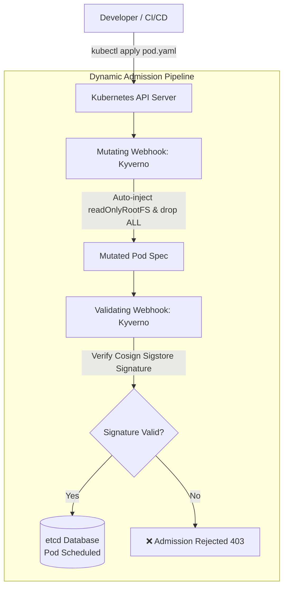

---

### Q4.5: Falco Runtime Threat Detection & Kernel Probe Evasion

**Scenario:** `k8s/falco/falco-rules.yaml` monitors syscall events across all worker nodes.

* **The Question:**
  1. How does Falco intercept kernel system calls via the eBPF probe driver (`sys_enter_execve`, `sys_enter_openat`, etc.)?
  2. How can an advanced adversary attempt to evade Falco syscall detection using fileless execution techniques (e.g., `memfd_create` + `execveat`, direct shellcode execution in memory without spawning a shell)?
  3. What happens to Falco alert delivery if the kernel ring buffer drops events under a massive burst of process creations?

#### 💡 Authoritative Master Answer & Architectural Analysis

1. **Falco eBPF Syscall Interception:**
   - Falco installs an eBPF driver program into the Linux kernel attached to tracepoints (`raw_syscalls:sys_enter` and `raw_syscalls:sys_exit`).
   - Every system call executed by any thread across the node is captured with its PID, UID, cgroup, container ID, and arguments.
   - The eBPF probe writes these events to a lockless, shared-memory **kernel ring buffer** (`BPF_MAP_TYPE_RINGBUF`), where the user-space Falco daemon reads and evaluates them against rulesets.

2. **Fileless Execution Evasion & Detection:**
   - **Evasion Mechanism:** Traditional Falco rules monitor `sys_enter_execve` matching binary paths on disk (e.g., `/bin/bash`). An advanced adversary uses `memfd_create()` to allocate an anonymous RAM-only file descriptor, writes an ELF payload directly into memory, and invokes it via `execveat(fd, ...)`. No binary touches the disk filesystem.
   - **Mitigation:** Update Falco rulesets to explicitly capture `memfd_create` and `execveat` syscall invocations originating from containerized namespaces.

3. **Ring Buffer Overflows & Alert Starvation:**
   - Under heavy syscall volume (e.g., fork bombs or ReDoS bursts), the fixed-size ring buffer fills up faster than the user-space Falco daemon can drain it, causing kernel packet drops (`falco_ring_buffer_drops_total`).
   - **Architectural Safeguard:** Monitor Falco drop metrics via Prometheus alerts and tune `buffer_dim` alongside kernel priority scheduling for the Falco daemon.

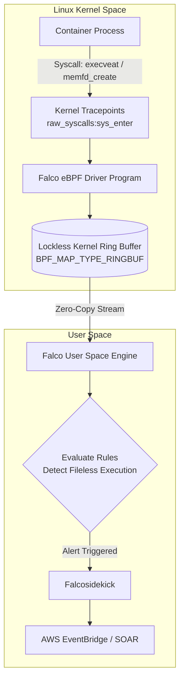

---

## 5. Threat Modeling, Incident Response & SOAR Automation

### Q5.1: STRIDE Threat Analysis of the CloudDevSecOps Platform

**Scenario:** Review the 3-tier architecture (Edge ➡️ Compute ➡️ RDS).

* **The Question:** Perform a complete **STRIDE** assessment on the Application Load Balancer to Compute Node boundary:
  - **S**poofing: How can an adversary spoof identity between ALB and Compute?
  - **T**ampering: Can HTTP payloads be modified in transit inside the VPC?
  - **R**epudiation: How are administrative database modifications audited?
  - **I**nformation Disclosure: How is sensitive data in transit protected without VPC endpoint encryption?
  - **D**enial of Service: What prevents an attacker from exhausting worker node compute resources?
  - **E**levation of Privilege: What prevents pod escape to the EC2 host?

#### 💡 Authoritative Master Answer & Architectural Analysis

| STRIDE Category | Threat Vector & Scenario | Platform Mitigation & Security Controls |
| :--- | :--- | :--- |
| **Spoofing** | Adversary sends direct requests to compute nodes, spoofing ALB origin. | Chained Security Groups (`Compute SG` allows only `ALB SG`), IMDSv2 hop limit = 1, and JWT signature verification. |
| **Tampering** | Packet interception or tampering within VPC network fabric. | **AWS Nitro intra-VPC hardware encryption** (automatically encrypts all traffic between Nitro instances with AES-256 GCM) and TLS 1.3. |
| **Repudiation** | Rogue admin updates RDS database or drops audit tables without logs. | AWS CloudTrail management logging, RDS Enhanced Monitoring, PostgreSQL `pgaudit` extension logging, and immutable S3 logs with Object Lock. |
| **Information Disclosure** | Plaintext credential harvesting or state file snooping. | AWS KMS Customer Managed Keys (CMKs), ephemeral IAM database authentication tokens, and Secrets Manager rotation. |
| **Denial of Service** | L7 volumetric flood exhausting EC2 CPU and memory. | AWS WAFv2 rate limiting (500 req/5m), ALB request throttling, Kubernetes CPU/Memory requests/limits, and horizontal pod autoscaling. |
| **Elevation of Privilege** | Container breakout or host root compromise via kernel exploit. | Distroless non-root containers (UID 65532), `readOnlyRootFilesystem`, dropped capabilities, Seccomp `RuntimeDefault`, and Kyverno admission controls. |

```mermaid
flowchart TD
    subgraph STRIDE Matrix
        S[Spoofing] -->|Mitigation| M1[Chained SGs + IMDSv2]
        T[Tampering] -->|Mitigation| M2[AWS Nitro In-Transit HW Encryption]
        R[Repudiation] -->|Mitigation| M3[pgaudit + CloudTrail Object Lock]
        I[Information Disclosure] -->|Mitigation| M4[KMS CMK + IAM DB Auth]
        D[Denial of Service] -->|Mitigation| M5[WAFv2 Rate Limits + K8s Limits]
        E[Elevation of Privilege] -->|Mitigation| M6[Distroless + Seccomp + Kyverno]
    end
```

---

### Q5.2: The Sub-3-Second SOAR Quarantine Loop Architecture

**Scenario:** When a container is compromised, Falco triggers an automated quarantine loop.

* **The Question:**
  1. Walk through the end-to-end data path from the moment an attacker executes `whoami` in a pod:
     `Falco Daemon` ➡️ `EventBridge` ➡️ `SOAR Lambda` ➡️ `Kubernetes API` ➡️ `Cilium BPF Map Update`.
  2. Where can race conditions occur in this pipeline?
  3. If the attacker deletes the Kubernetes API server connection or alters the pod's labels before Lambda acts, how can the SOAR engine guarantee containment at the network/eBPF level?

#### 💡 Authoritative Master Answer & Architectural Analysis

1. **Sub-3-Second Quarantine Data Pipeline:**
   - **$T_0$ (Execution):** Attacker spawns a shell or executes `whoami` inside a pod.
   - **$T_0 + 50\text{ms}$ (Detection):** Falco eBPF probe captures `sys_enter_execve`, matches rule `Terminal shell in container`, and emits a JSON event.
   - **$T_0 + 200\text{ms}$ (Forwarding):** Falcosidekick receives the alert and publishes an event to the AWS EventBridge custom bus.
   - **$T_0 + 800\text{ms}$ (SOAR Lambda):** EventBridge pattern triggers `soar-quarantine-lambda`.
   - **$T_0 + 1.8\text{s}$ (K8s / Cilium API):** Lambda calls Kubernetes API to apply label `quarantine: "true"`.
   - **$T_0 + 2.5\text{s}$ (eBPF Map Isolation):** Cilium detects the label update and rewrites the node's local eBPF BPF map (`cilium_policy`), dropping all ingress/egress packets at the Linux Traffic Control (TC) hook. Total elapsed time: **<3 seconds**.

2. **Race Conditions in the Pipeline:**
   - The attacker kills the local Falco agent process before the alert flushes.
   - The attacker rapidly alters or deletes the pod to trigger recreation before Lambda applies the quarantine label.

3. **Tamper-Proof Containment Guarantees:**
   - **eBPF Isolation from Container Namespace:** Containers running inside pods cannot modify host kernel memory or eBPF maps.
   - **AWS Hypervisor Level Fallback:** If the Kubernetes API server is unreachable, the SOAR Lambda can invoke AWS EC2 API to detach the node's Security Group and apply an `Isolated-SG` (deny all egress) directly at the Nitro hypervisor layer.

```mermaid
sequenceDiagram
    autonumber
    actor Attacker as Attacker (Shell in Pod)
    participant Kernel as Host eBPF Probe
    participant Falco as Falco Daemon
    participant Sidekick as Falcosidekick
    participant EB as AWS EventBridge
    participant Lambda as SOAR Lambda
    participant K8s as Kubernetes API
    participant Cilium as Cilium eBPF Engine

    Attacker->>Kernel: Spawn interactive shell (execve /bin/sh)
    Kernel->>Falco: Stream syscall event via RingBuffer
    Falco->>Sidekick: Forward JSON Alert
    Sidekick->>EB: Publish Event to EventBridge Bus
    EB->>Lambda: Trigger soar-quarantine-lambda
    Lambda->>K8s: Apply Pod Label: quarantine="true"
    K8s->>Cilium: Notify Policy Engine of Label Change
    Cilium->>Kernel: Update eBPF cilium_policy map (Drop All Packets)
    Note over Attacker,Kernel: 🚨 Pod Isolated at eBPF Layer in <3s
```

---

### Q5.3: Volatile Memory Forensics in Ephemeral Cloud Workloads

**Scenario:** A container is quarantined following an alert.

* **The Question:**
  - Standard Kubernetes auto-scaling or pod restarting immediately destroys volatile memory and process artifacts.
  - How would you architect an automated forensic pipeline that captures the container's volatile memory dump (`/proc/$PID/mem`), process namespace, and open network sockets before isolating or terminating the pod?

#### 💡 Authoritative Master Answer & Architectural Analysis

1. **Automated Forensic Acquisition Sequence:**
   - **Step 1: Cgroup Process Freeze:** To prevent the malware from modifying memory or self-destructing, the SOAR daemon freezes the container's cgroup:
     ```bash
     echo "1" > /sys/fs/cgroup/unified/kubepods.slice/.../cgroup.freeze
     ```
   - **Step 2: Volatile Memory Acquisition:** A privileged host forensic agent captures process memory directly from host RAM using `LiME` (Linux Memory Extractor) or `gcore` against the container's root PID (`/proc/$PID/mem`).
   - **Step 3: Network & Socket State Snapshot:** Export active socket tables (`ss -tupna`), routing tables, and active Cilium BPF conntrack buffers.
   - **Step 4: EBS Disk Volume Snapshot:** Trigger AWS API `ec2:CreateSnapshot` on the worker node's root EBS volume with tag `ForensicEvidence=true`.
   - **Step 5: Secure Evidence Shipping:** Stream the memory dump, process tree, and network captures to an **immutable S3 Forensic Vault** (configured with S3 Object Lock in Compliance Mode).

```mermaid
flowchart TD
    ALERT[SOAR Incident Trigger] --> FREEZE[1. Freeze Container Cgroup\ncgroup.freeze = 1]
    FREEZE --> MEM[2. Dump Volatile RAM\n/proc/$PID/mem & LiME]
    FREEZE --> NET[3. Dump Network State\nsocket table & Cilium BPF conntrack]
    FREEZE --> EBS[4. Snapshot Host EBS Volume\naws ec2 create-snapshot]
    
    MEM --> VAULT[(S3 Forensic Vault Bucket\n- S3 Object Lock / Compliance Mode\n- KMS CMK Encrypted)]
    NET --> VAULT
    EBS --> VAULT
    VAULT --> ISOLATE[5. Terminate / Quarantine Pod]
```

---

### Q5.4: Supply Chain Compromise: Malicious Dependency in Upstream Base Image

**Scenario:** A legitimate Go module imported by `secure-api` is hijacked on GitHub and updated with a malicious backdoor that executes after a 24-hour delay.

* **The Question:**
  - Which layers of our defense-in-depth pipeline would detect or prevent this attack at each stage:
    1. At Commit Time (Pre-commit)
    2. At Build Time (GitHub Actions CI)
    3. At Admission Time (Kubernetes API)
    4. At Runtime (Compute Node / Falco / Cilium)

#### 💡 Authoritative Master Answer & Architectural Analysis

```mermaid
flowchart LR
    subgraph 1. Pre-Commit
        PC1[Gitleaks]
        PC2[govulncheck]
    end

    subgraph 2. CI Build
        CI1[Syft SBOM Gen]
        CI2[Trivy Vulnerability Scan]
        CI3[Cosign Cryptographic Sign]
    end

    subgraph 3. Admission
        AD1[Kyverno Sigstore Verify]
        AD2[PSS Restricted]
    end

    subgraph 4. Runtime
        RT1[Falco eBPF Delay Exec Detection]
        RT2[Cilium Zero-Trust Egress Filter]
        RT3[SOAR Sub-3s Quarantine]
    end

    PC1 --> CI1 --> AD1 --> RT1
```

1. **Commit Stage (Pre-Commit):**
   - `govulncheck` and `trivy fs` scan `go.mod` / `go.sum` for known CVE entries in the Go vulnerability database. `gitleaks` prevents accidental credential commits.
2. **Build Stage (GitHub Actions CI):**
   - **SBOM Generation:** `Syft` generates a cryptographically hashed Software Bill of Materials (SBOM in SPDX/CycloneDX format).
   - **Trivy Container Scan:** Scans the layered container filesystem for vulnerabilities and malicious package hashes.
   - **Cosign Image Signing:** Signs the container digest using Sigstore OIDC keyless signing, binding the image to a verifiable commit SHA.
3. **Admission Stage (Kubernetes API):**
   - **Kyverno Admission Controller:** Rejects deployment if the image lacks a valid Cosign signature or if the SBOM indicates non-compliant high-severity CVEs.
4. **Runtime Stage (Compute / eBPF / Falco):**
   - **Falco Runtime Detection:** When the backdoor activates after 24 hours (attempting to spawn a reverse shell, read `/etc/shadow`, or execute unauthorized binaries), Falco eBPF tracepoints trigger an instant security event.
   - **Cilium Egress Microsegmentation:** Cilium blocks unauthorized outbound network traffic to unknown C2 server IPs.
   - **SOAR Quarantine:** EventBridge and Lambda isolate the pod in under 3 seconds.

---

### Q5.5: Blast Radius Containment of Compromised Compute Node vs. Pod

**Scenario:** An attacker discovers an unpatched Linux kernel vulnerability (e.g., zero-day dirty container escape) and gains root on the EC2 worker node host (`i-01d1755a716e14982`).

* **The Question:**
  1. What AWS resources can the attacker access from the EC2 host given the instance profile `cloud-devsecops-lab-node-profile`?
  2. Can the attacker access the RDS PostgreSQL database directly? (Explain why or why not using Security Group rules and database subnet configurations).
  3. Can the attacker decrypt other customers' data or other S3 buckets in the AWS account? (Explain KMS key policy constraints).

#### 💡 Authoritative Master Answer & Architectural Analysis

1. **IAM Instance Profile Confinement:**
   - The instance profile `cloud-devsecops-lab-node-profile` contains strictly scoped permissions:
     - `AmazonSSMManagedInstanceCore` (allows AWS Systems Manager session connectivity).
     - `ecr:GetAuthorizationToken`, `ecr:BatchGetImage` (pull container images).
   - The profile **strictly denies** IAM role modification, KMS administration, S3 state bucket access, and DynamoDB operations.

2. **RDS PostgreSQL Reachability:**
   - **Network Path:** The node is in the private compute subnet and belongs to `Compute SG`. The `Database SG` allows port 5432 ingress from `Compute SG`. Therefore, TCP packets can reach the RDS port.
   - **Authentication Barrier:** Network reachability alone does not grant data access. The attacker still requires valid database credentials or a signed IAM auth token. If the database enforces IAM Database Auth or dynamic Secrets Manager passwords with TLS, the attacker cannot authenticate.

3. **KMS & S3 Blast Radius Confinement:**
   - **KMS Key Policies:** The KMS CMK Key Policy limits decryption strictly to specific workload execution roles. The worker node's IAM instance profile has no `kms:Decrypt` permissions on Terraform state keys or customer data keys.
   - **S3 Bucket Isolation:** The remote Terraform state bucket explicitly denies all principals except the GitHub Actions deployment role ARN. The attacker cannot access state files or decrypt cross-tenant data.

```mermaid
flowchart TD
    subgraph Compromised Host: EC2 Node
        ATTACKER[Adversary with Root on EC2 Host]
        IAM_PROF[Instance Profile:\nSSM + ECR Pull Only]
    end

    subgraph Accessible Targets
        RDS[(RDS Postgres)]
        ECR[ECR Image Repo]
    end

    subgraph Blocked Targets
        KMS[KMS CMK Keys\n❌ No kms:Decrypt Permission]
        S3[S3 State Buckets\n❌ Denied by Bucket Policy]
        IAM[AWS IAM Service\n❌ No IAM Modify Privileges]
    end

    ATTACKER -->|Can Reach Port 5432\nNeeds DB Credentials| RDS
    ATTACKER -->|Can Pull Images| ECR
    ATTACKER -.->|❌ Blocked| KMS
    ATTACKER -.->|❌ Blocked| S3
    ATTACKER -.->|❌ Blocked| IAM
```

---

## 6. Cloud Architecture, FinOps & Multi-Tenancy Governance

### Q6.1: Multi-Account AWS Organization Architecture vs. Single-Account Isolation

**Scenario:** Our lab is currently in a single AWS account (`033781183622`).

* **The Question:**
  - How would you restructure this architecture into an enterprise **AWS Control Tower / Multi-Account Landing Zone**?
  - Detail the specific dedicated accounts required (e.g., *Log Archive Account, Security Tooling Account, Shared Services Network Hub Account, Core Production Account*).
  - How do **Service Control Policies (SCPs)** enforce security invariants that even an account `AdministratorAccess` user cannot disable?

#### 💡 Authoritative Master Answer & Architectural Analysis

1. **Enterprise Multi-Account Landing Zone Structure:**

```mermaid
graph TD
    ROOT[AWS Organization Root] --> MGMT[Management / Billing Account]
    ROOT --> OU_CORE[Core Security OU]
    ROOT --> OU_WORKLOADS[Workload OU]

    OU_CORE --> LOG[Log Archive Account\nCentralized S3 Object Lock]
    OU_CORE --> SEC[Security Tooling Account\nSecurity Hub, GuardDuty Master]
    OU_CORE --> NET[Network Hub Account\nTransit Gateway, Inspection VPC]

    OU_WORKLOADS --> DEV[Dev Account]
    OU_WORKLOADS --> STG[Staging Account]
    OU_WORKLOADS --> PROD[Production Account]

    SCP[Service Control Policies - SCPs] -.->|Enforce Invariants Across All Accounts| ROOT
```

2. **Dedicated Account Slices:**
   - **Management Account:** Consolidated billing, AWS Organizations, Service Control Policy root. No application workloads.
   - **Log Archive Account:** Centralized immutable S3 bucket with Object Lock (Compliance Mode) aggregating all AWS CloudTrail, VPC Flow Logs, and GuardDuty findings across all accounts.
   - **Security Tooling Account:** Delegated administrator for AWS Security Hub, Amazon GuardDuty, AWS IAM Identity Center, and Amazon Detective.
   - **Network Hub Account:** Central Transit Gateway, AWS Network Firewall / centralized egress NAT, and hybrid VPN/Direct Connect endpoints.
   - **Isolated Workload Accounts (Dev / Staging / Prod):** Complete blast-radius isolation. A breach in Dev cannot pivot to Prod.

3. **Service Control Policies (SCPs) as Inviolable Guardrails:**
   - SCPs are organizational policies that define the **maximum available permissions** for all IAM principals in an account.
   - Even if a user has `AdministratorAccess` or root credentials inside a member account, an SCP `Deny` statement acts as an absolute filter that cannot be bypassed or disabled locally:

```json
{
  "Version": "2012-10-17",
  "Statement": [
    {
      "Sid": "DenyDisablingSecurityServices",
      "Effect": "Deny",
      "Action": [
        "cloudtrail:StopLogging",
        "cloudtrail:DeleteTrail",
        "guardduty:DeleteDetector",
        "guardduty:DisassociateFromMasterAccount",
        "config:DeleteConfigRule"
      ],
      "Resource": "*"
    },
    {
      "Sid": "DenyUnapprovedRegions",
      "Effect": "Deny",
      "Action": "*",
      "Resource": "*",
      "Condition": {
        "StringNotEquals": {
          "aws:RequestedRegion": ["ap-southeast-1"]
        }
      }
    }
  ]
}
```

---

### Q6.2: FinOps Cost Guardrail Watchdog Architecture

**Scenario:** In `scripts/cost_guardrail_watchdog.sh` and `terraform/bootstrap/`, we enforce a $10 budget alarm with automated 50% credit threshold cleanup.

* **The Question:**
  1. Why is relying solely on AWS Budgets SNS notifications insufficient for real-time cost containment during an active cryptomining or DDoS event? (Discuss AWS Cost Explorer data ingestion latency of 8–24 hours).
  2. How would you design a real-time FinOps anomaly detection engine using CloudWatch Metrics, AWS Cost Anomaly Detection, and automated Lambda execution to terminate rogue EC2 Spot instances within 60 seconds of a spend spike?

#### 💡 Authoritative Master Answer & Architectural Analysis

1. **The Ingestion Latency Flaw in AWS Budgets:**
   - AWS Budgets and AWS Cost Explorer rely on billing pipeline batch processing with an **8 to 24-hour data ingestion latency**.
   - If an attacker compromises credentials and spins up 100 `p4d.24xlarge` GPU instances for cryptomining ($32/hr each = $3,200/hr), relying on AWS Budgets means the account could incur over **$50,000 in spend** before the first Budget SNS notification triggers.

2. **Sub-60-Second Real-Time FinOps Circuit Breaker Architecture:**
   - **Event-Driven CloudTrail + EventBridge:** Capture EC2 API calls (`RunInstances`, `CreateFleet`) in real-time.
   - **Real-Time Guardrail Lambda:** Lambda evaluates requested instance types and counts against an approved whitelist (e.g., only `t4g.*` and max 5 instances in Lab).
   - **Automated Kill Switch:** If an unauthorized instance type is launched or instance count exceeds threshold, the Lambda immediately calls `ec2:TerminateInstances` and revokes the originating IAM session in **<60 seconds**.
   - **CloudWatch Metric Stream:** Stream per-minute EC2 CPU and network metrics to detect unexpected spikes.

```mermaid
sequenceDiagram
    autonumber
    actor Attacker as Rogue Actor / Compromised Key
    participant EC2 as AWS EC2 API
    participant CT as AWS CloudTrail
    participant EB as AWS EventBridge
    participant Lambda as FinOps Circuit Breaker Lambda
    participant Alert as PagerDuty / Slack Alert

    Attacker->>EC2: RunInstances(Type: 20x p4d.24xlarge GPU)
    EC2-->>Attacker: Instances Pending
    EC2->>CT: Log RunInstances Event
    CT->>EB: Stream Event in Real-Time (<5s)
    EB->>Lambda: Trigger FinOps Validator
    Note over Lambda: Validate against instance whitelist.<br/>Disallowed instance type detected!
    Lambda->>EC2: ec2:TerminateInstances(p4d instances)
    Lambda->>Alert: Send High-Priority Spend Anomaly Alert
    Note over Attacker,EC2: 🛑 Threat Neutralized & Spend Capped in <60s
```

---

### Q6.3: Terraform State File Concurrency, Lock Contention & Split-Brain Prevention

**Scenario:** In commit `a55f513`, we added `-lock-timeout=60s` and concurrency groups to prevent DynamoDB lock contention in sequential CI/CD.

* **The Question:**
  - What exact DynamoDB table schema (`LockID` string hash key) and atomic conditional write (`attribute_not_exists(LockID)`) mechanism does Terraform use to acquire state locks?
  - What failure mode occurs if a CI/CD runner is forcefully killed by GitHub Actions during `terraform apply`? How does an automated pipeline safely recover from a stale state lock without human intervention or data corruption?

#### 💡 Authoritative Master Answer & Architectural Analysis

1. **DynamoDB State Lock Schema & Atomic Locking:**
   - **Schema:** DynamoDB table with a single primary partition key named `LockID` of type String (e.g., `<bucket-name>/terraform.tfstate-md5`).
   - **Atomic Conditional Write:** When executing `terraform plan` or `terraform apply`, Terraform issues a `PutItem` request containing JSON metadata (`Info` with execution ID, user, timestamp) with condition:
     ```
     attribute_not_exists(LockID)
     ```
   - If another runner holds the lock, DynamoDB rejects the write with `ConditionalCheckFailedException`, preventing race conditions and split-brain state corruption.

2. **Runner Termination & Stale Lock Recovery:**
   - **Failure Mode:** If GitHub Actions cancels a workflow or the runner runs out of memory during an apply, the lock item remains in DynamoDB indefinitely, blocking all future deployments with `Error: Error acquiring the state lock`.
   - **Safe Automated Recovery:**
     - In CI/CD pipelines, specify `-lock-timeout=60s` to allow transient locks to clear automatically.
     - Configure GitHub Actions **concurrency groups** (`concurrency: production-terraform-lock`) to queue workflows sequentially rather than executing in parallel.
     - For automated stale lock clearing: Write a recovery step that checks if the lock was created >2 hours ago and matches the terminated workflow ID, then calls `terraform force-unlock -force <LOCK_ID>`.

```mermaid
flowchart TD
    GHA[GitHub Actions Runner: terraform apply] --> LOCK{DynamoDB PutItem\nattribute_not_exists(LockID)}
    
    LOCK -->|Success| ACQ[Lock Acquired!\nExecute Infrastructure Modifications]
    LOCK -->|ConditionalCheckFailedException| WAIT{lock-timeout > 0?}
    
    WAIT -->|Retry within 60s timeout| LOCK
    WAIT -->|Timeout Expired| FAIL[❌ Pipeline Fails: State Locked]
    
    ACQ --> COMPLETE[Apply Complete]
    COMPLETE --> RELEASE[DynamoDB DeleteItem(LockID)\nLock Released]
    
    ACQ -.->|Runner Killed Forcefully| STALE[Stale Lock Remains in DynamoDB]
    STALE --> UNLOCK[terraform force-unlock <LOCK_ID>]
```

---

### Q6.4: Zero-Downtime Database Migration & Multi-AZ Failover Dynamics

**Scenario:** Upgrading RDS PostgreSQL from version 16.9 to 17.0 in the Production environment.

* **The Question:**
  - Detail the zero-downtime database upgrade strategy using PostgreSQL logical replication or AWS DMS (Database Migration Service).
  - During an automated Multi-AZ failover:
    1. How does AWS Route 53 CNAME updating redirect application traffic from primary to standby?
    2. What happens to inflight transactions and application connection pools during the 15–35 second DNS TTL failover window?
    3. How does AWS RDS Proxy mitigate connection thrashing during database failovers?

#### 💡 Authoritative Master Answer & Architectural Analysis

1. **Zero-Downtime Database Upgrade Strategy:**
   - **Step 1:** Provision a new target RDS PostgreSQL v17 instance in parallel.
   - **Step 2:** Configure PostgreSQL **Logical Replication** (or AWS DMS CDC - Change Data Capture) from v16 (Publisher) to v17 (Subscriber).
   - **Step 3:** Allow initial synchronization and monitor replication lag until it reaches **0 seconds**.
   - **Step 4 (Cutover Window):** Briefly set application to read-only mode, flip application connection string to the v17 endpoint, and restore full read-write traffic (downtime < 5 seconds).

2. **Multi-AZ Automated Failover Mechanics:**
   - **Route 53 CNAME Update:** RDS maintains a DNS endpoint (e.g., `prod-db.c1234567890.ap-southeast-1.rds.amazonaws.com`). Upon primary failure, RDS flips the standby in AZ-B to primary and updates the DNS record to point to the new IP address.
   - **Disruption Window:** DNS propagation takes **15 to 35 seconds**. Inflight transactions are abruptly terminated with connection resets. Applications without reconnection backoff logic crash or flood the network with retries.

3. **How AWS RDS Proxy Mitigates Failover Disruption:**
   - RDS Proxy maintains a persistent pool of established connections to both AZs.
   - During failover, RDS Proxy **holds incoming client SQL queries in an in-memory queue** rather than terminating client connections.
   - As soon as the standby is promoted, RDS Proxy routes queued queries to the new primary, reducing failover application downtime from **35 seconds to under 3 seconds** with zero client-side connection drops.

```mermaid
flowchart TD
    subgraph Direct Connection Failover (High Downtime)
        APP1[Application] -->|DNS Lookup: 15-35s TTL| R53[Route 53 DNS Record]
        R53 -->|Failover DNS Update| RDS_A[Failed Primary]
        APP1 -.->|❌ Connection Reset & Query Errors| RDS_A
    end

    subgraph RDS Proxy Connection Pooling (Zero-Downtime)
        APP2[Application] -->|Persistent Fast Connection| PROXY[AWS RDS Proxy]
        PROXY -->|1. Primary Fails: Queue Inflight SQL Queries| QUEUE[(Proxy In-Memory Queue)]
        PROXY -->|2. Standby Promoted in <3s: Flush Queue| RDS_B[New Primary Standby]
        RDS_B -->|✅ Zero Client Connection Drops| APP2
    end
```

---

### Q6.5: Supply Chain Security Level 3 (SLSA) Compliance Verification

**Scenario:** The user wants to audit this repository against the **Supply-chain Levels for Software Artifacts (SLSA) v1.0** framework.

* **The Question:**
  - Assess our current GitHub Actions pipeline (`01-security-lint`, `02-build-scan-sign`, `03-terraform-oidc-deploy`) against the 4 SLSA levels:
    - **Build Level 1**: Scripted build and provenance available.
    - **Build Level 2**: Hosted build service with authenticated provenance (GitHub Actions + Cosign).
    - **Build Level 3**: Hardened build platform preventing insider tampering (Hermetic builds, pinned action SHAs, isolated runners).
  - What specific enhancements are required to elevate our build pipeline to full **SLSA Level 4 / Hermetic Isolation**?

#### 💡 Authoritative Master Answer & Architectural Analysis

1. **Current Pipeline Assessment Against SLSA v1.0:**

| SLSA Level | Requirement Criteria | Current Platform Status |
| :--- | :--- | :--- |
| **Level 1** | Scripted build process, automated metadata generation. | ✅ **Compliant:** GitHub Actions workflows define automated build and test scripts. |
| **Level 2** | Hosted build service, cryptographically signed provenance (Cosign + Sigstore OIDC). | ✅ **Compliant:** Uses hosted GitHub Actions runners, generates Syft SBOM, signs artifacts with Cosign and publishes to Rekor. |
| **Level 3** | Hardened build platform, tamper-proof provenance, pinned action commit SHAs. | ⚠️ **Partial Compliance:** Uses pinned commit SHAs, but builds are not yet fully hermetic or isolated from network access. |
| **Level 4** | Complete hermetic build isolation, two-person code review, reproducible builds. | 🔄 **Target Goal:** Requires isolated offline container builds and strict cryptographic attestations. |

2. **Blueprint to Achieve SLSA Level 4 (Hermetic Isolation):**
   - **Hermetic Container Builds:** Execute builds in completely network-isolated environments where compilers cannot fetch external dependencies dynamically. Pre-vendor all Go dependencies (`go mod vendor`) and verify checksums against `go.sum`.
   - **Ephemeral Dedicated Runners (ARC):** Run builds on dedicated, hardened Kubernetes ephemeral runners using Actions Runner Controller (ARC) where runner containers are destroyed immediately upon task completion.
   - **Signed In-Toto Provenance Attestations:** Use the official SLSA GitHub Actions generator to generate cryptographically signed in-toto attestations capturing full source repository, builder ID, build parameters, and input digests.
   - **Admission Gate Verification:** Enforce Kyverno policies in Kubernetes to verify in-toto SLSA Level 4 attestations before admitting any container to production.

```mermaid
flowchart TD
    subgraph SLSA Level 4 Hermetic Pipeline
        GIT[GitHub Repo\nTwo-Person Review\nSigned Commits] --> ARC[Ephemeral Hardened Runner\nActions Runner Controller]
        
        subgraph Hermetic Build Container (No Internet Access)
            ARC --> VENDOR[Pre-fetched Vendor Dependencies\ngo.sum Hash Verification]
            VENDOR --> COMPILER[Go Static Compiler\nCGO_ENABLED=0]
            COMPILER --> BINARY[Deterministic Binary]
        end

        BINARY --> ATTEST[In-Toto SLSA Attestation Gen]
        ATTEST --> SIGN[Cosign Keyless Sigstore Sign]
        SIGN --> GHCR[GHCR OCI Registry]
        
        GHCR --> KYVERNO{Kyverno Admission Gate\nVerify SLSA L4 Attestation}
        KYVERNO -->|Verified| PROD[Production K8s Cluster]
        KYVERNO -->|Unverified| REJECT[❌ Admission Denied]
    end
```
